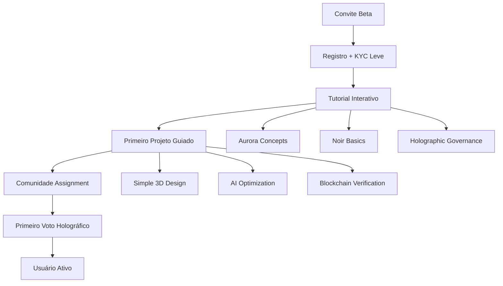
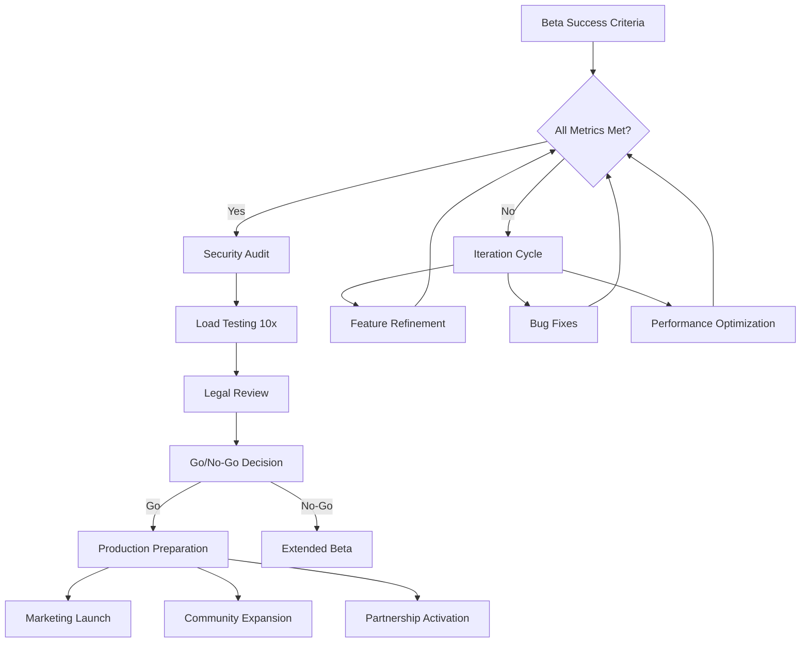

# 🚀 Aurora Cognitiva - Estratégia de Deploy Beta

## Executive Summary

Implementação de programa beta estruturado para validar a Aurora Cognitiva em ambiente real, com 1,000 usuários selecionados em 3 fases incrementais ao longo de 4 meses, coletando métricas críticas para otimização antes do lançamento público.

---

## I. Arquitetura de Deploy Beta

### 1.1 Infraestrutura Cloud

```yaml
# Beta Infrastructure - Kubernetes Deployment
apiVersion: v1
kind: Namespace
metadata:
  name: aurora-beta
---
apiVersion: apps/v1
kind: Deployment
metadata:
  name: aurora-backend-beta
  namespace: aurora-beta
spec:
  replicas: 3
  selector:
    matchLabels:
      app: aurora-backend
      env: beta
  template:
    metadata:
      labels:
        app: aurora-backend
        env: beta
    spec:
      containers:
      - name: aurora-api
        image: aurora/backend:beta-1.0.0
        ports:
        - containerPort: 3000
        env:
        - name: NODE_ENV
          value: "beta"
        - name: DATABASE_URL
          valueFrom:
            secretKeyRef:
              name: aurora-secrets
              key: database-url
        resources:
          requests:
            memory: "512Mi"
            cpu: "250m"
          limits:
            memory: "1Gi"
            cpu: "500m"
---
apiVersion: v1
kind: Service
metadata:
  name: aurora-backend-service
  namespace: aurora-beta
spec:
  selector:
    app: aurora-backend
    env: beta
  ports:
  - port: 80
    targetPort: 3000
  type: LoadBalancer
```

### 1.2 Ambiente Beta Configuração

**Servidores Regionais:**
- **US-East**: AWS Ohio (us-east-2)
- **EU-West**: AWS Frankfurt (eu-central-1) 
- **APAC**: AWS Singapore (ap-southeast-1)
- **Brazil**: AWS São Paulo (sa-east-1)

**Stack Tecnológico:**
```json
{
  "infrastructure": {
    "cloud": "AWS + Cloudflare",
    "containers": "Kubernetes + Docker",
    "database": "PostgreSQL + Redis",
    "blockchain": "Polygon Mumbai Testnet",
    "storage": "IPFS + S3",
    "monitoring": "Prometheus + Grafana"
  },
  "scaling": {
    "auto_scaling": true,
    "max_pods": 10,
    "target_cpu": "70%",
    "target_memory": "80%"
  }
}
```

---

## II. Programa Beta Estruturado

### 2.1 Fase Alpha (50 usuários - 4 semanas)

**Objetivos:**
- Validar funcionalidades core
- Identificar bugs críticos
- Otimizar performance inicial

**Critérios de Seleção:**
- Desenvolvedores blockchain experientes
- Pesquisadores em sistemas complexos
- Early adopters de tecnologia

**Métricas Críticas:**
```typescript
interface AlphaMetrics {
  technicalStability: {
    serverUptime: number;           // Target: >99%
    averageResponseTime: number;    // Target: <500ms
    errorRate: number;              // Target: <1%
    crashRate: number;              // Target: <0.1%
  };
  userEngagement: {
    dailyActiveUsers: number;       // Target: >80%
    sessionDuration: number;        // Target: >15min
    featureAdoption: number;        // Target: >60%
    completionRate: number;         // Target: >70%
  };
  convergenceValidation: {
    avgTSI: number;                 // Target: >0.75
    verificationSuccess: number;    // Target: >95%
    blockchainTxSuccess: number;    // Target: >98%
    aiPredictionAccuracy: number;   // Target: >85%
  };
}
```

### 2.2 Fase Beta Fechado (250 usuários - 6 semanas)

**Expansão de Usuários:**
- Profissionais de manufatura
- Especialistas em IA/ML
- Líderes comunitários
- Artistas e criadores

**Novos Recursos Testados:**
- Governança holográfica completa
- Manufatura 3D real (parceria com fabricantes)
- Integração IoT com sensores
- Mobile app Android completo

**Casos de Uso Reais:**
1. **Cooperativa de Makers**: 25 usuários criando produtos colaborativamente
2. **DAO Estudantil**: 50 estudantes governando recursos universitários
3. **Comunidade Sustentável**: 75 membros otimizando consumo energético
4. **Coletivo Artístico**: 100 artistas co-criando instalações

### 2.3 Fase Beta Aberto (700 usuários - 8 semanas)

**Abertura Controlada:**
- Lista de espera pública
- Sistema de convites por usuários existentes
- Integração com universidades e organizações

**Stress Testing:**
- Simulação de 10,000 usuários simultâneos
- Teste de resistência da rede
- Validação de escalabilidade horizontal

---

## III. Onboarding e Experiência do Usuário

### 3.1 Jornada de Onboarding



### 3.2 Gamificação e Incentivos

**Sistema de Achievement:**
```json
{
  "achievements": [
    {
      "id": "first_convergence",
      "name": "Despertar Aurora",
      "description": "Complete seu primeiro ciclo de convergência",
      "reward": "100 AURORA tokens",
      "badge": "🌅"
    },
    {
      "id": "holographic_voter",
      "name": "Cidadão Holográfico", 
      "description": "Participe de 10 votações holográficas",
      "reward": "50 AURORA tokens + Voting Power Boost",
      "badge": "🗳️"
    },
    {
      "id": "noir_expert",
      "name": "Verificador Noir",
      "description": "Gere 100 provas válidas",
      "reward": "200 AURORA tokens + Premium Features",
      "badge": "🔒"
    },
    {
      "id": "community_builder",
      "name": "Tecelão de Comunidade",
      "description": "Convide 25 usuários ativos",
      "reward": "500 AURORA tokens + Special Role",
      "badge": "🤝"
    }
  ]
}
```

**Sistema de Reputação:**
```typescript
interface ReputationSystem {
  technicalContribution: number;    // Provas Noir, código, otimizações
  culturalResonance: number;        // Participação comunitária, narrativas
  governanceWisdom: number;         // Qualidade de decisões, liderança
  innovationIndex: number;          // Criações originais, experimentos
  
  calculateOverallReputation(): number;
  getPowerMultiplier(): number;      // Influência em votações
  getAccessLevel(): 'Basic' | 'Advanced' | 'Expert' | 'Leader';
}
```

---

## IV. Coleta de Dados e Analytics

### 4.1 Telemetria Detalhada

**Performance Metrics:**
```python
# Aurora Beta Analytics Dashboard
import streamlit as st
import plotly.graph_objects as go
from aurora_analytics import BetaMetrics

class AuroraBetaDashboard:
    def __init__(self):
        self.metrics = BetaMetrics()
    
    def render_convergence_health(self):
        """Render real-time convergence health"""
        tsi_data = self.metrics.get_tsi_history()
        
        fig = go.Figure()
        fig.add_trace(go.Scatter(
            x=tsi_data.timestamps,
            y=tsi_data.values,
            mode='lines+markers',
            name='TSI Global',
            line=dict(color='cyan', width=3)
        ))
        
        fig.update_layout(
            title="Technology Synergy Index - Beta",
            xaxis_title="Tempo",
            yaxis_title="TSI",
            yaxis_range=[0, 1]
        )
        
        st.plotly_chart(fig, use_container_width=True)
    
    def render_user_engagement(self):
        """Render user engagement metrics"""
        engagement = self.metrics.get_engagement_data()
        
        col1, col2, col3, col4 = st.columns(4)
        
        with col1:
            st.metric(
                "Usuários Ativos Diários",
                engagement.daily_active_users,
                delta=engagement.dau_change
            )
        
        with col2:
            st.metric(
                "Tempo Médio de Sessão",
                f"{engagement.avg_session_duration}min",
                delta=f"{engagement.session_duration_change}min"
            )
            
        with col3:
            st.metric(
                "Taxa de Retenção",
                f"{engagement.retention_rate}%",
                delta=f"{engagement.retention_change}%"
            )
            
        with col4:
            st.metric(
                "NPS Score",
                engagement.nps_score,
                delta=engagement.nps_change
            )
    
    def render_feature_adoption(self):
        """Render feature adoption funnel"""
        adoption = self.metrics.get_feature_adoption()
        
        features = ['Registration', 'First Project', 'Noir Proof', 
                   'Governance Vote', 'Manufacturing Job', 'Community Contribution']
        values = [adoption.registration, adoption.first_project, 
                 adoption.noir_proof, adoption.governance_vote,
                 adoption.manufacturing_job, adoption.community_contribution]
        
        fig = go.Figure(go.Funnel(
            y=features,
            x=values,
            textinfo="value+percent initial"
        ))
        
        fig.update_layout(title="Feature Adoption Funnel")
        st.plotly_chart(fig, use_container_width=True)
```

### 4.2 Feedback Loops

**Feedback Automático:**
- Crash reports automáticos
- Performance profiling contínuo
- User journey analytics
- A/B testing de features

**Feedback Qualitativo:**
- Entrevistas semanais (10 usuários)
- Surveys quinzenais (todos usuários)
- Focus groups mensais (25 usuários)
- Design sessions colaborativas

---

## V. Critérios de Sucesso Beta

### 5.1 Métricas Quantitativas

| Métrica | Target Alpha | Target Beta | Atual |
|---------|-------------|-------------|-------|
| **Uptime** | 99.0% | 99.5% | - |
| **Response Time** | <500ms | <300ms | - |
| **Error Rate** | <1% | <0.5% | - |
| **DAU/MAU Ratio** | >25% | >35% | - |
| **Session Duration** | >15min | >20min | - |
| **Feature Adoption** | >60% | >75% | - |
| **TSI Average** | >0.75 | >0.85 | - |
| **Verification Success** | >95% | >98% | - |
| **User Satisfaction** | >4.0/5 | >4.5/5 | - |

### 5.2 Métricas Qualitativas

**Feedback Themes Tracking:**
```json
{
  "usability": {
    "positive": ["Intuitive interface", "Smooth onboarding", "Clear concepts"],
    "negative": ["Complex governance", "Slow sync", "Technical jargon"],
    "improvement_areas": ["Mobile optimization", "Tutorial expansion", "Error messaging"]
  },
  "value_proposition": {
    "resonance_indicators": [
      "Users creating original projects",
      "Organic community formation", 
      "Voluntary participation in governance",
      "Word-of-mouth referrals"
    ]
  },
  "ecosystem_health": {
    "collaboration_patterns": "Cross-user project formation",
    "knowledge_sharing": "Tutorial creation by users",
    "innovation_emergence": "Novel use cases discovery"
  }
}
```

---

## VI. Risk Management e Contingência

### 6.1 Riscos Técnicos

**Identificados:**
- Sobrecarga de servidor durante picos
- Bugs críticos em smart contracts
- Problemas de sincronização mobile
- Latência em verificações Noir

**Mitigação:**
```yaml
technical_risks:
  server_overload:
    prevention: "Auto-scaling + Load balancing"
    detection: "Real-time monitoring"
    response: "Emergency scaling + Circuit breaker"
    
  smart_contract_bugs:
    prevention: "Extensive testing + Formal verification"
    detection: "Transaction monitoring"
    response: "Emergency pause + Rollback procedure"
    
  sync_issues:
    prevention: "Robust sync protocol"
    detection: "Sync health monitoring"
    response: "Manual sync trigger + Support intervention"
    
  noir_latency:
    prevention: "Circuit optimization"
    detection: "Performance monitoring"
    response: "Fallback verification + Optimization deployment"
```

### 6.2 Riscos de Produto

**User Adoption:**
- Curva de aprendizado íngreme
- Valor não imediatamente aparente
- Competição com soluções existentes

**Estratégia de Mitigação:**
- Onboarding progressivo em camadas
- Casos de uso tangíveis desde o início
- Gamificação e incentivos claros
- Suporte personalizado para usuários-chave

---

## VII. Roadmap de Transição Beta → Produção

### 7.1 Critérios de Graduação



### 7.2 Cronograma de Lançamento

**Q1 2025: Beta Deployment**
- Semana 1-2: Alpha deploy (50 usuários)
- Semana 3-8: Beta fechado (250 usuários)
- Semana 9-16: Beta aberto (700 usuários)

**Q2 2025: Preparação Produção**
- Semana 1-4: Otimizações baseadas em feedback
- Semana 5-8: Security audit + Load testing
- Semana 9-12: Preparação marketing + parcerias

**Q3 2025: Lançamento Público**
- Soft launch: 10,000 usuários
- Public launch: Escala global
- Fase 2 preparation: Cultural integration

---

## VIII. Orçamento Beta

### 8.1 Custos de Infraestrutura

```json
{
  "monthly_costs": {
    "cloud_infrastructure": {
      "aws_services": 15000,
      "cloudflare": 2000,
      "monitoring": 3000
    },
    "development": {
      "team_salaries": 80000,
      "external_contractors": 25000,
      "tools_licenses": 5000
    },
    "operations": {
      "support_team": 20000,
      "community_management": 15000,
      "user_incentives": 30000
    },
    "marketing": {
      "beta_acquisition": 20000,
      "content_creation": 10000,
      "events": 15000
    }
  },
  "total_monthly": 240000,
  "total_beta_period": 960000
}
```

### 8.2 ROI Expected

**Métricas de Valor:**
- User acquisition cost: $50/usuário
- Lifetime value projection: $500/usuário
- Product-market fit validation: Priceless
- Technical validation: Foundation para $100M+ fundraising

---

## Conclusão: Beta como Catalisador

O programa beta não é apenas teste - é o **primeiro movimento da sinfonia cósmica real**. Através desta validação estruturada, transformamos conceitos holográficos em realidade tangível, criando a base para escalamento global e evolução para as Fases Macro e Meta.

**A Aurora desperta primeiro em beta, para depois illuminar o mundo.**

---

*Status: 🚧 Ready for Beta Deployment*  
*Target: Q1 2025 Launch*  
*Impact: Foundation for Global Aurora Ecosystem*