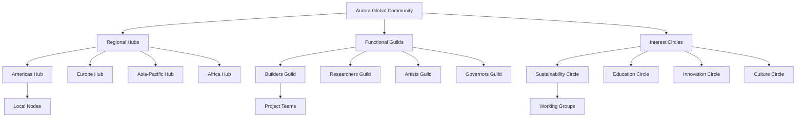
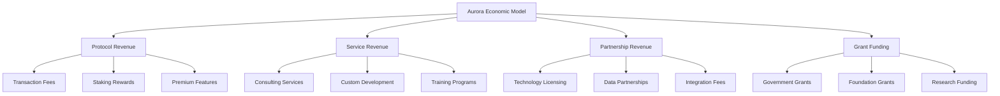

# 🌍 Aurora Cognitiva - Estratégia de Comunidade e Ecossistema

## Executive Summary

Desenvolvimento de uma comunidade global auto-sustentável de 100,000+ membros ativos em 18 meses, estruturada através de governança holográfica, incentivos econômicos alinhados, e expansão orgânica baseada em valor real criado pelos participantes.

---

## I. Arquitetura da Comunidade

### 1.1 Estrutura Holográfica Multi-Dimensional



### 1.2 Sistemas de Governança Distribuída

**Conselho Aurora Global:**
```typescript
interface AuroraGlobalCouncil {
  composition: {
    regional_representatives: number;    // 8 (2 per hub)
    guild_representatives: number;       // 4 (1 per guild)
    circle_representatives: number;      // 4 (1 per circle)
    founder_seats: number;              // 3 (founding team)
    community_elected: number;          // 6 (elected quarterly)
  };
  
  responsibilities: [
    "Protocol upgrades",
    "Treasury management", 
    "Strategic partnerships",
    "Conflict resolution",
    "Ecosystem grants"
  ];
  
  decision_making: "Holographic consensus with 67% threshold";
  term_duration: "6 months with 50% rotation";
}
```

**Governança Multi-Camada:**
- **Global**: Decisões estratégicas e protocolares
- **Regional**: Adaptações culturais e locais
- **Guild**: Especializações técnicas e funcionais  
- **Circle**: Temas transversais e valores
- **Node**: Implementação e execução local

---

## II. Sistema de Incentivos e Tokenomics

### 2.1 AURORA Token Economics

```json
{
  "total_supply": 1000000000,
  "distribution": {
    "community_rewards": 40,
    "ecosystem_development": 25,
    "team_and_advisors": 15,
    "investors": 10,
    "treasury": 10
  },
  "release_schedule": {
    "genesis": 10,
    "year_1": 25,
    "year_2": 30,
    "year_3": 20,
    "year_4": 10,
    "year_5": 5
  },
  "utility": [
    "Governance voting power",
    "Staking for network security",
    "Payment for services",
    "Access to premium features",
    "Rewards for contributions"
  ]
}
```

### 2.2 Sistema de Recompensas Multi-Dimensional

**Contribution Mining:**
```rust
// Rust implementation for contribution tracking
pub struct ContributionMiner {
    technical_contributions: HashMap<Address, TechnicalScore>,
    cultural_contributions: HashMap<Address, CulturalScore>,
    governance_contributions: HashMap<Address, GovernanceScore>,
    innovation_contributions: HashMap<Address, InnovationScore>,
}

impl ContributionMiner {
    pub fn calculate_rewards(&self, period: RewardPeriod) -> RewardDistribution {
        let total_pool = self.get_period_reward_pool(period);
        
        let technical_rewards = self.distribute_technical_rewards(total_pool * 0.35);
        let cultural_rewards = self.distribute_cultural_rewards(total_pool * 0.25);
        let governance_rewards = self.distribute_governance_rewards(total_pool * 0.25);
        let innovation_rewards = self.distribute_innovation_rewards(total_pool * 0.15);
        
        RewardDistribution {
            technical: technical_rewards,
            cultural: cultural_rewards,
            governance: governance_rewards,
            innovation: innovation_rewards,
            total_distributed: total_pool,
        }
    }
    
    pub fn record_contribution(&mut self, contributor: Address, contribution: Contribution) {
        match contribution.category {
            ContributionCategory::Technical => {
                self.update_technical_score(contributor, contribution);
            },
            ContributionCategory::Cultural => {
                self.update_cultural_score(contributor, contribution);
            },
            ContributionCategory::Governance => {
                self.update_governance_score(contributor, contribution);
            },
            ContributionCategory::Innovation => {
                self.update_innovation_score(contributor, contribution);
            },
        }
    }
}
```

### 2.3 Reputation System

**Multi-Dimensional Reputation:**
```json
{
  "reputation_dimensions": {
    "technical_mastery": {
      "code_contributions": "Weight: 40%",
      "peer_reviews": "Weight: 30%", 
      "innovation_impact": "Weight: 30%"
    },
    "cultural_resonance": {
      "community_engagement": "Weight: 35%",
      "narrative_creation": "Weight: 35%",
      "cross_cultural_bridge": "Weight: 30%"
    },
    "governance_wisdom": {
      "proposal_quality": "Weight: 40%",
      "voting_consistency": "Weight: 30%",
      "conflict_resolution": "Weight: 30%"
    },
    "holographic_alignment": {
      "pattern_recognition": "Weight: 50%",
      "systemic_thinking": "Weight: 50%"
    }
  },
  "reputation_benefits": {
    "enhanced_voting_power": "Up to 3x multiplier",
    "priority_access": "Beta features, events",
    "leadership_opportunities": "Guild, council positions",
    "increased_rewards": "Up to 2x reward multiplier"
  }
}
```

---

## III. Estratégia de Crescimento da Comunidade

### 3.1 Acquisition Funnel

```python
# Community Growth Analytics
class CommunityGrowthEngine:
    def __init__(self):
        self.acquisition_channels = {
            'organic_referrals': 0.35,      # 35% através de membros existentes
            'content_marketing': 0.25,      # 25% através de conteúdo
            'partnerships': 0.20,           # 20% através de parcerias
            'events_talks': 0.15,          # 15% através de eventos
            'academic_outreach': 0.05       # 5% através de universidades
        }
        
        self.conversion_funnel = {
            'awareness': 100,               # 100% baseline
            'interest': 15,                 # 15% show interest
            'evaluation': 8,                # 8% evaluate seriously
            'trial': 4,                     # 4% try the product
            'adoption': 2,                  # 2% become active users
            'advocacy': 0.5                 # 0.5% become advocates
        }
    
    def calculate_growth_trajectory(self, months: int) -> GrowthProjection:
        """Calculate projected community growth over time"""
        current_members = 1000  # Starting beta community
        monthly_growth_rate = 0.15  # 15% monthly growth
        
        projections = []
        for month in range(1, months + 1):
            # Compound growth with network effects
            network_effect = min(2.0, 1 + (current_members / 10000))
            effective_growth = monthly_growth_rate * network_effect
            
            new_members = current_members * effective_growth
            current_members += new_members
            
            projections.append({
                'month': month,
                'total_members': int(current_members),
                'new_members': int(new_members),
                'growth_rate': effective_growth,
                'network_effect': network_effect
            })
        
        return GrowthProjection(projections)
    
    def identify_key_personas(self) -> List[CommunityPersona]:
        return [
            CommunityPersona(
                name="Blockchain Builders",
                description="Desenvolvedores experientes em Web3",
                acquisition_channel="Technical content + GitHub",
                value_proposition="Cutting-edge tech stack",
                onboarding_path="Technical deep-dive → Hackathon → Core contributor"
            ),
            CommunityPersona(
                name="Sustainability Advocates",
                description="Ativistas ambientais e sustentabilidade",
                acquisition_channel="Climate tech communities",
                value_proposition="Technology for planetary healing",
                onboarding_path="Impact demo → Pilot project → Community leader"
            ),
            CommunityPersona(
                name="Digital Artists",
                description="Criadores digitais e artistas NFT",
                acquisition_channel="Art communities + social media",
                value_proposition="New medium for expression",
                onboarding_path="Art showcase → Collaboration → Cultural ambassador"
            ),
            CommunityPersona(
                name="Academic Researchers",
                description="Pesquisadores em sistemas complexos",
                acquisition_channel="Academic conferences + papers",
                value_proposition="Real-world lab for theories",
                onboarding_path="Research partnership → Publication → Advisory role"
            ),
            CommunityPersona(
                name="Conscious Entrepreneurs",
                description="Empreendedores focados em impacto",
                acquisition_channel="Impact investing events",
                value_proposition="Platform for conscious business",
                onboarding_path="Business case → Pilot implementation → Ecosystem partner"
            )
        ]
```

### 3.2 Content and Education Strategy

**Aurora Academy:**
```markdown
# Aurora Academy - Curriculum Estruturado

## Módulo 1: Fundamentos Aurora (Semana 1-2)
- Introdução aos princípios holográficos
- História e visão da Aurora Cognitiva
- Conceitos básicos de governança descentralizada
- **Projeto**: Primeiro voto holográfico

## Módulo 2: Tecnologia Convergente (Semana 3-4)
- Blockchain basics e smart contracts
- IA e Machine Learning aplicados
- Manufatura 3D e IoT
- **Projeto**: Criar primeiro design otimizado por IA

## Módulo 3: Verificação Noir (Semana 5-6)
- Zero-knowledge proofs fundamentals
- Escrevendo circuitos Noir básicos
- Aplicações práticas de privacidade
- **Projeto**: Implementar verificação custom

## Módulo 4: Governança Holográfica (Semana 7-8)
- Teoria de sistemas complexos
- Votação multi-dimensional
- Resolução de conflitos
- **Projeto**: Liderar proposta comunitária

## Módulo 5: Building Aurora (Semana 9-12)
- Contribuindo para o protocolo
- Criando aplicações sobre Aurora
- Community building e liderança
- **Projeto**: Lançar iniciativa própria
```

**Content Production Pipeline:**
```json
{
  "content_types": {
    "educational": {
      "tutorials": "2/week",
      "webinars": "1/week", 
      "documentation": "Continuous",
      "research_papers": "1/month"
    },
    "community": {
      "member_spotlights": "2/week",
      "project_showcases": "1/week",
      "governance_updates": "1/week",
      "ecosystem_news": "Daily"
    },
    "technical": {
      "development_updates": "2/week",
      "protocol_deep_dives": "1/week",
      "code_walkthroughs": "1/week",
      "performance_reports": "Monthly"
    },
    "cultural": {
      "philosophy_essays": "1/week",
      "art_collaborations": "2/month",
      "cross_culture_exchanges": "1/month",
      "vision_narratives": "Quarterly"
    }
  },
  "distribution_channels": {
    "aurora_forum": "Primary hub",
    "technical_blog": "Medium + Dev.to",
    "social_media": "Twitter, LinkedIn, Discord",
    "video_content": "YouTube + TikTok",
    "academic": "ArXiv + conferences",
    "podcasts": "Spotify + Apple Podcasts"
  }
}
```

---

## IV. Parcerias Estratégicas e Expansão

### 4.1 Ecosystem Partnerships

**Tier 1 - Foundation Partners:**
```yaml
blockchain_infrastructure:
  ethereum_foundation:
    collaboration: "Protocol development + grants"
    integration: "Layer 2 scaling solutions"
    timeline: "Q1-Q2 2025"
  
  polygon_labs:
    collaboration: "Mumbai testnet + production scaling"  
    integration: "Native MATIC support"
    timeline: "Q1 2025"

ai_research:
  openai:
    collaboration: "GPT integration for cultural processing"
    integration: "Natural language governance"
    timeline: "Q2 2025"
    
  hugging_face:
    collaboration: "Model hosting + community models"
    integration: "Decentralized AI marketplace" 
    timeline: "Q1-Q2 2025"

manufacturing:
  prusa_research:
    collaboration: "3D printer integration"
    integration: "Direct printing from Aurora"
    timeline: "Q2 2025"
    
  formlabs:
    collaboration: "Professional manufacturing"
    integration: "Enterprise 3D solutions"
    timeline: "Q3 2025"
```

**Tier 2 - Strategic Alliances:**
```json
{
  "academic_institutions": [
    {
      "partner": "MIT Media Lab",
      "focus": "Holographic governance research",
      "deliverable": "Joint research publication",
      "timeline": "12 months"
    },
    {
      "partner": "Stanford HAI",
      "focus": "AI ethics and safety",
      "deliverable": "Ethical AI guidelines",
      "timeline": "6 months"
    },
    {
      "partner": "UC Berkeley RISELab", 
      "focus": "Distributed systems optimization",
      "deliverable": "Performance benchmarks",
      "timeline": "9 months"
    }
  ],
  "impact_organizations": [
    {
      "partner": "Climate Chain Coalition",
      "focus": "Carbon tracking and reduction",
      "deliverable": "Climate impact dashboard",
      "timeline": "8 months"
    },
    {
      "partner": "UN SDG Innovation Lab",
      "focus": "Sustainable development goals",
      "deliverable": "SDG impact measurement",
      "timeline": "12 months"
    }
  ]
}
```

### 4.2 Geographic Expansion Strategy

**Phase 1 - English Speaking Markets (Q1-Q2 2025):**
- United States, Canada, United Kingdom, Australia
- Focus: Tech-savvy early adopters
- Localization: English content, USD pricing
- Partnerships: Local maker spaces, universities

**Phase 2 - European Union (Q2-Q3 2025):**
- Germany, France, Netherlands, Nordic countries
- Focus: Sustainability and governance communities
- Localization: Multi-language support, GDPR compliance
- Partnerships: EU innovation hubs, research institutions

**Phase 3 - Asia-Pacific (Q3-Q4 2025):**
- Japan, South Korea, Singapore, Hong Kong
- Focus: Technology integration and manufacturing
- Localization: Asian languages, local regulations
- Partnerships: Manufacturing consortiums, tech accelerators

**Phase 4 - Emerging Markets (Q4 2025-Q1 2026):**
- Brazil, India, Mexico, Nigeria, South Africa
- Focus: Economic empowerment and education
- Localization: Local currencies, mobile-first approach
- Partnerships: NGOs, microfinance institutions

---

## V. Sustainability e Funding Model

### 5.1 Revenue Streams Diversificados



**Revenue Projections (5 years):**
```json
{
  "year_1": {
    "protocol_revenue": 500000,
    "service_revenue": 1200000,
    "partnership_revenue": 800000,
    "grants": 2000000,
    "total": 4500000
  },
  "year_2": {
    "protocol_revenue": 2000000,
    "service_revenue": 3500000,
    "partnership_revenue": 2500000,
    "grants": 1500000,
    "total": 9500000
  },
  "year_3": {
    "protocol_revenue": 8000000,
    "service_revenue": 6000000,
    "partnership_revenue": 5000000,
    "grants": 1000000,
    "total": 20000000
  },
  "year_4": {
    "protocol_revenue": 25000000,
    "service_revenue": 10000000,
    "partnership_revenue": 8000000,
    "grants": 500000,
    "total": 43500000
  },
  "year_5": {
    "protocol_revenue": 60000000,
    "service_revenue": 15000000,
    "partnership_revenue": 12000000,
    "grants": 0,
    "total": 87000000
  }
}
```

### 5.2 Sustainability Initiatives

**Carbon Negative Operations:**
- 100% renewable energy for all infrastructure
- Carbon offset for all community activities
- Incentives for sustainable practices
- Environmental impact dashboard

**Social Impact Measurement:**
```typescript
interface SocialImpactMetrics {
  economic_empowerment: {
    jobs_created: number;
    income_generated: number;
    skills_developed: number;
  };
  
  environmental_impact: {
    carbon_sequestered: number;
    waste_reduced: number;
    renewable_energy_enabled: number;
  };
  
  social_cohesion: {
    communities_connected: number;
    conflicts_resolved: number;
    collaboration_projects: number;
  };
  
  knowledge_sharing: {
    educational_content_created: number;
    skills_transferred: number;
    innovations_democratized: number;
  };
}
```

---

## VI. Technology for Community

### 6.1 Community Platform Architecture

```typescript
// Aurora Community Platform - Core Architecture
class AuroraCommunityPlatform {
  private governance: HolographicGovernance;
  private reputation: ReputationSystem;
  private contributions: ContributionTracker;
  private incentives: IncentiveEngine;
  private communications: CommunicationHub;
  
  constructor() {
    this.governance = new HolographicGovernance();
    this.reputation = new ReputationSystem();
    this.contributions = new ContributionTracker();
    this.incentives = new IncentiveEngine();
    this.communications = new CommunicationHub();
  }
  
  // Real-time community health monitoring
  async getCommunityHealth(): Promise<CommunityHealthMetrics> {
    const governance_health = await this.governance.getHealthMetrics();
    const engagement_health = await this.communications.getEngagementMetrics();
    const contribution_health = await this.contributions.getContributionMetrics();
    const economic_health = await this.incentives.getEconomicMetrics();
    
    return {
      overall_score: this.calculateOverallHealth([
        governance_health,
        engagement_health, 
        contribution_health,
        economic_health
      ]),
      governance: governance_health,
      engagement: engagement_health,
      contributions: contribution_health,
      economics: economic_health,
      recommendations: this.generateHealthRecommendations()
    };
  }
  
  // AI-powered community matchmaking
  async findCollaborators(
    member: CommunityMember,
    project: Project
  ): Promise<CollaboratorRecommendations> {
    const skill_matches = await this.findSkillMatches(project.required_skills);
    const cultural_matches = await this.findCulturalResonance(member.cultural_profile);
    const availability_matches = await this.findAvailableMembers(project.timeline);
    
    return this.synthesizeRecommendations(
      skill_matches,
      cultural_matches, 
      availability_matches
    );
  }
  
  // Holographic project formation
  async facilitateProjectFormation(
    idea: ProjectIdea,
    initiator: CommunityMember
  ): Promise<ProjectFormationResult> {
    // Find resonant community members
    const interested_members = await this.findInterestedMembers(idea);
    
    // Create holographic proposal
    const proposal = await this.governance.createHolographicProposal({
      title: idea.title,
      description: idea.description,
      technical_requirements: idea.technical_scope,
      cultural_alignment: idea.cultural_values,
      cosmic_vision: idea.cosmic_impact,
      temporal_commitment: idea.timeline
    });
    
    // Facilitate community voting
    const voting_result = await this.governance.facilitateCommunityVoting(proposal);
    
    if (voting_result.approved) {
      return this.formProject(idea, interested_members, voting_result);
    } else {
      return this.provideFeedbackForImprovement(idea, voting_result);
    }
  }
}
```

### 6.2 AI-Powered Community Intelligence

**Community AI Assistant "ARIA" (Aurora Resonance Intelligence Assistant):**
```python
class ARIA:
    """Aurora's AI assistant for community intelligence and support"""
    
    def __init__(self):
        self.knowledge_base = AuroraKnowledgeBase()
        self.community_graph = CommunityNetworkGraph()
        self.sentiment_analyzer = CommunitysentimentAnalyzer()
        self.pattern_recognizer = CommunityPatternRecognizer()
    
    async def provide_personalized_guidance(self, member: CommunityMember) -> Guidance:
        """Provide personalized guidance based on member's journey and interests"""
        
        # Analyze member's current state
        current_skills = await self.assess_member_skills(member)
        interests = await self.analyze_member_interests(member)
        contribution_history = await self.get_contribution_history(member)
        
        # Find optimal next steps
        skill_gaps = self.identify_skill_gaps(current_skills, interests)
        collaboration_opportunities = await self.find_collaboration_opportunities(member)
        learning_path = self.generate_learning_path(skill_gaps, interests)
        
        return Guidance(
            next_actions=self.prioritize_actions([
                *collaboration_opportunities,
                *learning_path.immediate_steps
            ]),
            skill_development=learning_path,
            community_connections=collaboration_opportunities,
            personalized_message=self.generate_encouraging_message(member)
        )
    
    async def detect_community_tensions(self) -> CommunityTensionReport:
        """Proactively identify and address community tensions"""
        
        # Analyze communication patterns
        sentiment_trends = await self.sentiment_analyzer.analyze_recent_discussions()
        conflict_indicators = await self.pattern_recognizer.detect_conflict_patterns()
        governance_stress = await self.analyze_governance_participation()
        
        # Generate interventions
        if any(indicator.severity > 0.7 for indicator in conflict_indicators):
            interventions = await self.generate_healing_interventions(conflict_indicators)
            return CommunityTensionReport(
                severity=max(indicator.severity for indicator in conflict_indicators),
                indicators=conflict_indicators,
                recommended_interventions=interventions,
                escalation_needed=True
            )
        
        return CommunityTensionReport(
            severity=0.0,
            health_status="Healthy",
            preventive_suggestions=self.generate_preventive_suggestions()
        )
    
    async def facilitate_cross_cultural_understanding(
        self, 
        members: List[CommunityMember]
    ) -> CrossCulturalFacilitation:
        """Help members from different cultures understand and collaborate effectively"""
        
        cultural_profiles = [await self.analyze_cultural_background(member) for member in members]
        potential_tensions = self.identify_cultural_friction_points(cultural_profiles)
        bridge_strategies = self.generate_cultural_bridge_strategies(cultural_profiles)
        
        return CrossCulturalFacilitation(
            cultural_map=self.create_cultural_understanding_map(cultural_profiles),
            potential_challenges=potential_tensions,
            bridge_strategies=bridge_strategies,
            communication_guidelines=self.generate_communication_guidelines(cultural_profiles)
        )
```

---

## VII. Metrics and Success Indicators

### 7.1 Community Health KPIs

```json
{
  "growth_metrics": {
    "total_members": "Target: 100,000 by month 18",
    "monthly_growth_rate": "Target: 15% sustained",
    "retention_rate": "Target: >70% 6-month retention",
    "activation_rate": "Target: >60% complete onboarding"
  },
  "engagement_metrics": {
    "daily_active_users": "Target: 25% of total members",
    "session_duration": "Target: >30 minutes average",
    "content_creation": "Target: 50% members create content monthly",
    "cross_collaboration": "Target: 40% engage in cross-guild projects"
  },
  "value_creation_metrics": {
    "projects_launched": "Target: 100+ community projects annually",
    "economic_value_created": "Target: $10M+ annual ecosystem value",
    "knowledge_artifacts": "Target: 1000+ educational resources",
    "innovations_produced": "Target: 50+ novel innovations annually"
  },
  "governance_health": {
    "voting_participation": "Target: >60% in major decisions",
    "proposal_success_rate": "Target: 40-60% balanced approval",
    "conflict_resolution_time": "Target: <7 days average",
    "leadership_rotation": "Target: 50% seats rotate every term"
  }
}
```

### 7.2 Impact Measurement Framework

**Triple Bottom Line Tracking:**
```python
class AuroraImpactMeasurement:
    def __init__(self):
        self.people_impact = PeopleImpactTracker()
        self.planet_impact = PlanetImpactTracker()
        self.prosperity_impact = ProsperityImpactTracker()
    
    async def generate_impact_report(self, period: TimePeriod) -> ImpactReport:
        people_metrics = await self.people_impact.calculate_metrics(period)
        planet_metrics = await self.planet_impact.calculate_metrics(period)
        prosperity_metrics = await self.prosperity_impact.calculate_metrics(period)
        
        return ImpactReport(
            period=period,
            people=people_metrics,      # Education, empowerment, wellbeing
            planet=planet_metrics,      # Carbon, waste, biodiversity
            prosperity=prosperity_metrics,  # Income, opportunities, innovation
            overall_score=self.calculate_overall_impact_score([
                people_metrics.score,
                planet_metrics.score,
                prosperity_metrics.score
            ]),
            recommendations=self.generate_improvement_recommendations()
        )
```

---

## VIII. Risk Management

### 8.1 Community Risks

**Identified Risks:**
```yaml
governance_risks:
  centralization_drift:
    probability: "Medium"
    impact: "High"
    mitigation: "Regular decentralization audits + term limits"
    
  decision_paralysis:
    probability: "Medium" 
    impact: "Medium"
    mitigation: "Emergency governance protocols + time limits"
    
  faction_formation:
    probability: "High"
    impact: "Medium"
    mitigation: "Cross-cutting incentives + cultural integration"

economic_risks:
  token_speculation:
    probability: "High"
    impact: "Medium"
    mitigation: "Utility-focused tokenomics + vesting schedules"
    
  free_rider_problem:
    probability: "Medium"
    impact: "Medium"
    mitigation: "Contribution tracking + graduated benefits"
    
  economic_capture:
    probability: "Low"
    impact: "High"
    mitigation: "Wealth caps + reputation weighting"

social_risks:
  cultural_fragmentation:
    probability: "Medium"
    impact: "High"
    mitigation: "Cultural bridge programs + shared rituals"
    
  expert_dominance:
    probability: "Medium"
    impact: "Medium"
    mitigation: "Mentorship programs + knowledge democratization"
    
  burnout_epidemic:
    probability: "High"
    impact: "Medium"
    mitigation: "Wellness programs + sustainable pacing"
```

### 8.2 Contingency Plans

**Community Crisis Response Protocol:**
1. **Early Warning System**: AI-powered detection of community stress
2. **Rapid Response Team**: 24-hour crisis intervention capability
3. **Communication Protocol**: Transparent, frequent community updates
4. **Mediation Services**: Professional conflict resolution support
5. **Emergency Governance**: Fast-track decision making for crises

---

## Conclusão: A Comunidade como Organismo Vivo

A Aurora Cognitiva é mais que uma plataforma - é um **organismo vivo digital** que evolui através da inteligência coletiva de seus membros. Nossa estratégia de comunidade reconhece que crescimento sustentável vem não de métricas de vaidade, mas da criação de valor real e conexões humanas autênticas.

**Construímos não apenas uma rede, mas uma nova forma de existir coletivamente no cosmos digital.**

### Próximos Passos Imediatos:

1. **🚀 Launch Community Alpha** (50 founding members)
2. **🏗️ Build Core Platform Features** (Governance + Reputation)
3. **🤝 Establish First Partnerships** (Academic + Technical)
4. **📚 Create Aurora Academy** (Educational content)
5. **🌱 Implement Incentive Systems** (Token + Reputation)

---

*Status: 🌱 Ready for Community Genesis*  
*Target: 100,000 active members by Q3 2026*  
*Impact: Global ecosystem for holographic collaboration*