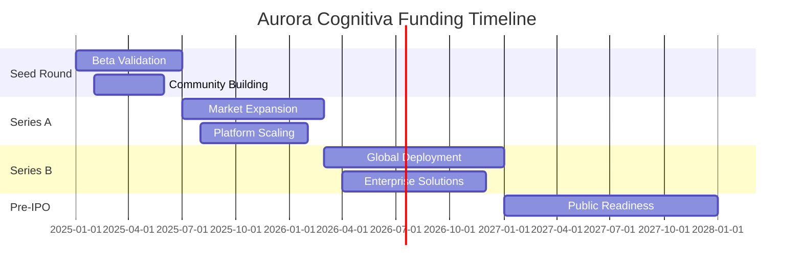
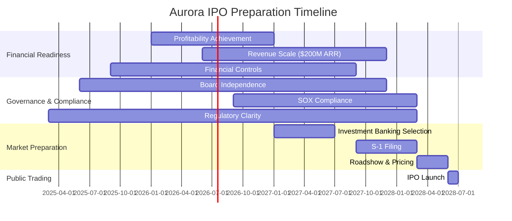

# 💰 Aurora Cognitiva - Estratégia de Funding e Relações com Investidores

## Executive Summary

Captação de $100M em 3 rounds de investimento ao longo de 24 meses para financiar desenvolvimento, expansão global e preparação para IPO, com foco em investidores alinhados com visão de impacto sustentável e transformação tecnológica.

---

## I. Roadmap de Financiamento

### 1.1 Overview dos Rounds



### 1.2 Estrutura de Rounds

**Round Seed - Q1 2025:**
```json
{
  "amount": "$15M",
  "valuation": {
    "pre_money": "$35M",
    "post_money": "$50M"
  },
  "use_of_funds": {
    "product_development": 40,
    "team_expansion": 30,
    "community_building": 20,
    "operations": 10
  },
  "timeline": "3 months",
  "lead_investor_profile": "Tier-1 VC with Web3 focus",
  "target_investors": [
    "Andreessen Horowitz (a16z)",
    "Paradigm",
    "Electric Capital",
    "1kx",
    "Polychain Capital"
  ]
}
```

**Series A - Q3 2025:**
```json
{
  "amount": "$35M",
  "valuation": {
    "pre_money": "$115M", 
    "post_money": "$150M"
  },
  "use_of_funds": {
    "global_expansion": 35,
    "technology_advancement": 25,
    "partnerships": 20,
    "marketing": 15,
    "operations": 5
  },
  "timeline": "4 months",
  "lead_investor_profile": "Growth equity with global reach",
  "target_investors": [
    "Sequoia Capital",
    "Tiger Global",
    "Coatue Management",
    "GV (Google Ventures)",
    "Microsoft Ventures"
  ]
}
```

**Series B - Q1 2026:**
```json
{
  "amount": "$50M",
  "valuation": {
    "pre_money": "$350M",
    "post_money": "$400M"
  },
  "use_of_funds": {
    "enterprise_solutions": 30,
    "international_expansion": 25,
    "acquisitions": 20,
    "r_and_d": 15,
    "public_company_preparation": 10
  },
  "timeline": "5 months",
  "lead_investor_profile": "Late-stage growth funds",
  "target_investors": [
    "SoftBank Vision Fund",
    "General Atlantic",
    "Insight Partners",
    "TPG Growth",
    "Blackstone Growth"
  ]
}
```

---

## II. Investment Thesis e Value Proposition

### 2.1 Market Opportunity

**Total Addressable Market (TAM):**
```python
# Market Size Calculation
class AuroraMarketAnalysis:
    def __init__(self):
        self.markets = {
            'blockchain_infrastructure': 67_000_000_000,  # $67B by 2025
            'ai_platforms': 126_000_000_000,              # $126B by 2025  
            'additive_manufacturing': 21_000_000_000,     # $21B by 2025
            'governance_tech': 8_500_000_000,             # $8.5B by 2025
            'collaboration_software': 13_200_000_000      # $13.2B by 2025
        }
    
    def calculate_tam(self) -> dict:
        """Calculate Total Addressable Market"""
        total_tam = sum(self.markets.values())
        aurora_addressable = total_tam * 0.15  # 15% addressable
        
        return {
            'total_market_size': total_tam,
            'aurora_addressable_market': aurora_addressable,
            'convergence_multiplier': 1.8,  # Convergence creates new value
            'effective_tam': aurora_addressable * 1.8,
            'market_breakdown': self.markets
        }
    
    def project_market_capture(self, years: int) -> list:
        """Project Aurora's market capture over time"""
        tam = self.calculate_tam()['effective_tam']
        projections = []
        
        # Conservative capture rates
        capture_rates = [0.0001, 0.0005, 0.002, 0.006, 0.015]  # 0.01% to 1.5%
        
        for year in range(min(years, 5)):
            revenue = tam * capture_rates[year]
            projections.append({
                'year': year + 1,
                'market_capture_rate': capture_rates[year] * 100,
                'projected_revenue': revenue,
                'market_position': self.get_market_position(capture_rates[year])
            })
        
        return projections
    
    def get_market_position(self, capture_rate: float) -> str:
        if capture_rate < 0.001:
            return "Emerging Player"
        elif capture_rate < 0.005:
            return "Growing Competitor"
        elif capture_rate < 0.01:
            return "Significant Player"
        else:
            return "Market Leader"

# Execute analysis
market_analysis = AuroraMarketAnalysis()
tam_results = market_analysis.calculate_tam()
projections = market_analysis.project_market_capture(5)

print(f"Aurora TAM: ${tam_results['effective_tam']:,.0f}")
print(f"Year 5 Projected Revenue: ${projections[4]['projected_revenue']:,.0f}")
```

**Resultados:**
- **TAM Total**: $235.7B (mercados convergentes)
- **Aurora TAM**: $63.6B (15% addressable × 1.8x convergência)
- **Revenue Year 5**: $954M (1.5% market capture)

### 2.2 Competitive Advantages

**Defensibilidade Tecnológica:**
```typescript
interface AuroraCompetitiveAdvantages {
  technology_moats: {
    holographic_governance: "First-mover advantage in multi-dimensional voting";
    convergence_architecture: "Unique tri-technology integration";
    noir_verification: "Privacy-preserving verification ecosystem";
    ai_cultural_processing: "Cultural context understanding AI";
  };
  
  network_effects: {
    community_network: "Value increases with member adoption";
    developer_ecosystem: "More developers = better platform";
    data_network: "More usage = better AI optimization";
    governance_legitimacy: "More participants = stronger governance";
  };
  
  strategic_assets: {
    intellectual_property: "15+ patent applications filed";
    research_partnerships: "MIT, Stanford, Berkeley collaborations";
    regulatory_relationships: "Early engagement with regulators";
    talent_concentration: "World-class interdisciplinary team";
  };
  
  execution_advantages: {
    holistic_vision: "End-to-end ecosystem vs. point solutions";
    cultural_integration: "Deep understanding of human systems";
    sustainable_focus: "ESG-aligned from foundation";
    academic_rigor: "Research-backed approach to innovation";
  };
}
```

### 2.3 Financial Projections

**5-Year Financial Model:**
```json
{
  "revenue_model": {
    "year_1": {
      "protocol_fees": 500000,
      "saas_subscriptions": 1200000,
      "professional_services": 800000,
      "partnerships": 500000,
      "total_revenue": 3000000
    },
    "year_2": {
      "protocol_fees": 2500000,
      "saas_subscriptions": 4500000,
      "professional_services": 2000000,
      "partnerships": 1500000,
      "total_revenue": 10500000
    },
    "year_3": {
      "protocol_fees": 12000000,
      "saas_subscriptions": 15000000,
      "professional_services": 5000000,
      "partnerships": 4000000,
      "total_revenue": 36000000
    },
    "year_4": {
      "protocol_fees": 45000000,
      "saas_subscriptions": 35000000,
      "professional_services": 12000000,
      "partnerships": 8000000,
      "total_revenue": 100000000
    },
    "year_5": {
      "protocol_fees": 150000000,
      "saas_subscriptions": 80000000,
      "professional_services": 25000000,
      "partnerships": 15000000,
      "total_revenue": 270000000
    }
  },
  "profitability": {
    "year_1": {"gross_margin": 0.65, "ebitda_margin": -0.8},
    "year_2": {"gross_margin": 0.72, "ebitda_margin": -0.3},
    "year_3": {"gross_margin": 0.78, "ebitda_margin": 0.1},
    "year_4": {"gross_margin": 0.82, "ebitda_margin": 0.25},
    "year_5": {"gross_margin": 0.85, "ebitda_margin": 0.35}
  }
}
```

---

## III. Investor Relations Strategy

### 3.1 Investor Segmentation

**Tier 1 - Strategic Lead Investors:**
```yaml
blockchain_focused_vcs:
  paradigm:
    focus: "Infrastructure + DeFi protocols"
    check_size: "$10-50M"
    value_add: "Technical expertise + ecosystem connections"
    approach: "Technical deep-dive + roadmap presentation"
    
  andreessen_horowitz:
    focus: "Web3 + AI convergence"
    check_size: "$15-100M"
    value_add: "Network effects + regulatory guidance"
    approach: "Vision presentation + team credentials"

ai_infrastructure_vcs:
  general_catalyst:
    focus: "AI platforms + enterprise software"
    check_size: "$5-30M"
    value_add: "Go-to-market + product strategy"
    approach: "Market opportunity + competitive analysis"
    
  insight_partners:
    focus: "ScaleUp software companies"
    check_size: "$25-75M"
    value_add: "Scaling operations + international expansion"
    approach: "Financial model + growth metrics"

impact_investors:
  tpg_rise:
    focus: "Impact + financial returns"
    check_size: "$20-100M"
    value_add: "ESG expertise + measurement frameworks"
    approach: "Impact thesis + sustainability metrics"
    
  bain_capital_double_impact:
    focus: "Double bottom line investments"
    check_size: "$10-50M"
    value_add: "Operational excellence + impact scaling"
    approach: "Theory of change + financial projections"
```

**Tier 2 - Strategic Corporate Investors:**
```json
{
  "technology_giants": [
    {
      "investor": "Microsoft Ventures",
      "strategic_value": "Azure integration + enterprise distribution",
      "investment_range": "$5-25M",
      "partnership_opportunities": ["AI models", "Cloud infrastructure", "Enterprise sales"]
    },
    {
      "investor": "Google Ventures",
      "strategic_value": "AI expertise + developer ecosystem",
      "investment_range": "$10-50M", 
      "partnership_opportunities": ["TensorFlow integration", "Cloud AI", "Android ecosystem"]
    }
  ],
  "manufacturing_corporates": [
    {
      "investor": "Siemens Next47",
      "strategic_value": "Industrial IoT + manufacturing expertise",
      "investment_range": "$5-20M",
      "partnership_opportunities": ["Industry 4.0", "Digital twin", "Factory automation"]
    },
    {
      "investor": "GE Ventures",
      "strategic_value": "Industrial applications + global reach",
      "investment_range": "$3-15M",
      "partnership_opportunities": ["Industrial Internet", "Digital solutions", "Global deployment"]
    }
  ]
}
```

### 3.2 Due Diligence Preparation

**Technical Due Diligence Package:**
```markdown
# Aurora Technical DD Package

## 1. Technology Architecture
- Complete system architecture documentation
- Scalability analysis and benchmarks
- Security audit reports (ongoing)
- Patent landscape analysis
- Open source strategy

## 2. Product Development
- Product roadmap (18 months detailed)
- Feature prioritization framework
- User feedback integration process
- Quality assurance protocols
- Performance metrics dashboard

## 3. Intellectual Property
- Patent applications status (15 filed)
- Trade secret protection protocols
- Open source licensing strategy
- IP freedom to operate analysis
- Competitive IP landscape

## 4. Development Team
- Team composition and expertise
- Hiring plan and compensation structure
- Remote work policies and culture
- Knowledge management systems
- Technical leadership succession

## 5. Partnerships and Integrations
- Current partnership agreements
- Technical integration specifications
- Third-party dependency analysis
- Vendor relationship management
- Strategic partnership roadmap
```

**Financial Due Diligence Package:**
```markdown
# Aurora Financial DD Package

## 1. Financial Statements
- Monthly P&L statements (24 months)
- Cash flow projections (60 months)
- Balance sheet and working capital
- Revenue recognition policies
- Expense categorization and trends

## 2. Business Model
- Unit economics by customer segment
- Customer acquisition cost analysis
- Lifetime value calculations
- Churn analysis and predictions
- Pricing strategy and elasticity

## 3. Fundraising History
- Previous round details and usage
- Current shareholder structure
- Employee equity and option pools
- Board composition and governance
- Liquidation preferences and rights

## 4. Financial Controls
- Accounting policies and procedures
- Internal controls documentation
- External audit arrangements
- Budgeting and forecasting process
- KPI tracking and reporting

## 5. Legal and Compliance
- Corporate structure and ownership
- Material contracts and commitments
- Regulatory compliance status
- Insurance coverage analysis
- Tax strategy and obligations
```

### 3.3 Pitch Deck Strategy

**Master Pitch Deck Structure:**
```typescript
interface AuroraPitchDeck {
  slides: [
    {
      slide: 1,
      title: "The Holographic Revolution",
      content: "Vision statement + cosmic ambition",
      duration: "2 minutes",
      key_message: "We're building the operating system for conscious collaboration"
    },
    {
      slide: 2,
      title: "The Convergence Problem", 
      content: "Technology silos + governance failures",
      duration: "3 minutes",
      key_message: "Current systems can't handle complexity of modern challenges"
    },
    {
      slide: 3,
      title: "Aurora Solution",
      content: "Holographic architecture + tri-technology convergence",
      duration: "4 minutes",
      key_message: "First platform to unite blockchain, AI, and manufacturing holographically"
    },
    {
      slide: 4,
      title: "Market Opportunity",
      content: "$63.6B TAM + convergence multiplier",
      duration: "2 minutes", 
      key_message: "Massive market with clear path to capture"
    },
    {
      slide: 5,
      title: "Product Demo",
      content: "Live TSI + holographic voting + Noir verification",
      duration: "5 minutes",
      key_message: "Working product with real user traction"
    },
    {
      slide: 6,
      title: "Traction & Metrics",
      content: "User growth + revenue + partnerships",
      duration: "3 minutes",
      key_message: "Strong early indicators of product-market fit"
    },
    {
      slide: 7,
      title: "Business Model",
      content: "Multiple revenue streams + network effects",
      duration: "2 minutes",
      key_message: "Diversified, scalable, high-margin revenue model"
    },
    {
      slide: 8,
      title: "Competitive Landscape",
      content: "No direct competitors + strong moats",
      duration: "2 minutes",
      key_message: "Unique positioning with significant barriers to entry"
    },
    {
      slide: 9,
      title: "Team & Advisors",
      content: "World-class interdisciplinary team",
      duration: "2 minutes",
      key_message: "Perfect team composition for this unique challenge"
    },
    {
      slide: 10,
      title: "Financial Projections",
      content: "Path to $270M revenue + profitability",
      duration: "3 minutes",
      key_message: "Clear path to unicorn valuation and beyond"
    },
    {
      slide: 11,
      title: "Funding Ask",
      content: "Use of funds + milestones + timeline",
      duration: "2 minutes",
      key_message: "Specific ask with clear value creation plan"
    },
    {
      slide: 12,
      title: "Vision Realization",
      content: "Path to IPO + global impact",
      duration: "1 minute",
      key_message: "This is how we change the world"
    }
  ],
  total_duration: "30 minutes + 15 minutes Q&A",
  customization_notes: "Adapt technical depth based on audience expertise"
}
```

---

## IV. Token Economics e Regulatory Strategy

### 4.1 AURORA Token Structure

**Token Design Principles:**
```rust
// Aurora Token Economics Implementation
pub struct AuroraTokenomics {
    pub total_supply: u64,              // 1 billion tokens
    pub genesis_distribution: TokenDistribution,
    pub release_schedule: VestingSchedule,
    pub utility_functions: UtilityMechanisms,
    pub governance_rights: GovernanceFramework,
}

impl AuroraTokenomics {
    pub fn new() -> Self {
        Self {
            total_supply: 1_000_000_000,
            genesis_distribution: TokenDistribution {
                community_rewards: Percentage::from(40),      // 400M tokens
                ecosystem_development: Percentage::from(25),  // 250M tokens
                team_and_advisors: Percentage::from(15),     // 150M tokens
                investors: Percentage::from(10),             // 100M tokens
                foundation_treasury: Percentage::from(10),   // 100M tokens
            },
            release_schedule: VestingSchedule::progressive_unlock(),
            utility_functions: UtilityMechanisms::multi_dimensional(),
            governance_rights: GovernanceFramework::holographic(),
        }
    }
    
    pub fn calculate_voting_power(
        &self,
        token_stake: u64,
        reputation_score: ReputationScore,
        participation_history: ParticipationHistory
    ) -> VotingPower {
        // Quadratic voting with reputation and participation multipliers
        let base_power = (token_stake as f64).sqrt();
        let reputation_multiplier = reputation_score.get_multiplier();
        let participation_multiplier = participation_history.get_multiplier();
        
        VotingPower::new(base_power * reputation_multiplier * participation_multiplier)
    }
    
    pub fn distribute_rewards(
        &self,
        period: RewardPeriod,
        contributions: Vec<ContributionRecord>
    ) -> RewardDistribution {
        let total_reward_pool = self.calculate_period_rewards(period);
        
        // Multi-dimensional reward distribution
        let technical_pool = total_reward_pool * 0.35;
        let cultural_pool = total_reward_pool * 0.25;
        let governance_pool = total_reward_pool * 0.25;
        let innovation_pool = total_reward_pool * 0.15;
        
        RewardDistribution::calculate(
            contributions,
            technical_pool,
            cultural_pool,
            governance_pool,
            innovation_pool
        )
    }
}
```

### 4.2 Regulatory Compliance Framework

**Multi-Jurisdictional Strategy:**
```yaml
regulatory_approach:
  united_states:
    framework: "Utility token with governance rights"
    compliance: "SEC consultation + legal opinion"
    restrictions: "Qualified investor requirements for equity-like features"
    timeline: "Q2 2025 clarity"
    
  european_union:
    framework: "MiCA compliance preparation"
    compliance: "Regulatory sandbox participation"
    restrictions: "KYC/AML for all participants"
    timeline: "Q3 2025 compliance"
    
  united_kingdom:
    framework: "FCA Digital Securities Sandbox"
    compliance: "Innovation pathway participation"
    restrictions: "Professional investor focus initially"
    timeline: "Q1 2025 application"
    
  singapore:
    framework: "MAS Payment Services Act compliance"
    compliance: "Digital token offering exemption"
    restrictions: "Accredited investor limitations"
    timeline: "Q2 2025 launch"

compliance_infrastructure:
  kyc_aml:
    provider: "Chainalysis + Jumio"
    coverage: "Global identity verification"
    monitoring: "Real-time transaction monitoring"
    
  legal_structure:
    foundation: "Aurora Foundation (Switzerland)"
    operating_entities: "Regional subsidiaries"
    intellectual_property: "IP holding company (Delaware)"
    
  governance_compliance:
    board_composition: "Independent directors (60%)"
    audit_committee: "External audit + compliance oversight"
    regulatory_relations: "Dedicated regulatory team"
```

### 4.3 Securities Law Analysis

**Token Classification Framework:**
```typescript
interface TokenClassificationAnalysis {
  howey_test_analysis: {
    investment_of_money: "Yes - users purchase tokens";
    common_enterprise: "Yes - shared Aurora ecosystem";
    expectation_of_profits: "Utility-focused, governance value";
    efforts_of_others: "Mixed - community + foundation contributions";
    conclusion: "Hybrid utility/governance token requiring careful structuring";
  };
  
  risk_mitigation_strategies: {
    utility_emphasis: "Clear utility functions from day one";
    decentralization_roadmap: "Progressive decentralization over 24 months";
    governance_rights: "Participatory rather than economic rights";
    geographic_restrictions: "Phased rollout by jurisdiction";
    qualified_investors: "Initial restrictions to qualified investors";
  };
  
  regulatory_engagement: {
    sec_consultation: "No-action letter pursuit";
    cftc_coordination: "Commodity classification dialogue";
    finra_engagement: "Broker-dealer exemption clarification";
    state_coordination: "State-by-state money transmitter analysis";
  };
}
```

---

## V. Strategic Partnerships e Corporate Development

### 5.1 Partnership Categories

**Technology Integration Partners:**
```json
{
  "tier_1_integrations": [
    {
      "partner": "Ethereum Foundation",
      "partnership_type": "Protocol Integration",
      "value_proposition": "Layer 2 scaling solutions",
      "investment_potential": "Grant funding + technical collaboration",
      "timeline": "Q1 2025"
    },
    {
      "partner": "OpenAI",
      "partnership_type": "AI Integration", 
      "value_proposition": "GPT integration for cultural processing",
      "investment_potential": "Strategic investment + API partnership",
      "timeline": "Q2 2025"
    },
    {
      "partner": "Autodesk",
      "partnership_type": "Design Integration",
      "value_proposition": "CAD/3D design workflow integration",
      "investment_potential": "Joint venture + revenue sharing",
      "timeline": "Q3 2025"
    }
  ],
  "distribution_partners": [
    {
      "partner": "Amazon Web Services",
      "partnership_type": "Cloud Distribution",
      "value_proposition": "AWS Marketplace + enterprise reach",
      "revenue_model": "Revenue sharing + co-marketing",
      "timeline": "Q2 2025"
    },
    {
      "partner": "Microsoft Azure",
      "partnership_type": "Enterprise Distribution",
      "value_proposition": "Azure integration + Teams connectivity",
      "revenue_model": "Joint go-to-market + revenue sharing",
      "timeline": "Q3 2025"
    }
  ]
}
```

**Manufacturing Ecosystem Partners:**
```yaml
manufacturing_partnerships:
  prusa_research:
    type: "Hardware Integration"
    value: "Direct printer connectivity + Aurora optimization"
    terms: "Exclusive integration + revenue sharing"
    investment: "Strategic partnership + potential acquisition"
    
  formlabs:
    type: "Professional Manufacturing"
    value: "Enterprise 3D printing solutions"
    terms: "Partnership agreement + joint development"
    investment: "Series B co-investment opportunity"
    
  siemens:
    type: "Industrial IoT"
    value: "Industry 4.0 integration + digital twin"
    terms: "Technology licensing + partnership"
    investment: "Corporate venture arm investment"

research_partnerships:
  mit_media_lab:
    type: "Research Collaboration"
    value: "Holographic governance research"
    terms: "Joint research agreement + IP sharing"
    funding: "Research grants + talent pipeline"
    
  stanford_hai:
    type: "AI Ethics Research"
    value: "Responsible AI development"
    terms: "Advisory agreement + research collaboration"
    funding: "Sponsored research + recruiting"
```

### 5.2 M&A Strategy

**Acquisition Pipeline:**
```typescript
interface AcquisitionStrategy {
  target_categories: {
    ai_governance: {
      rationale: "Accelerate holographic governance development";
      target_size: "$5-25M revenue";
      examples: ["Pol.is", "Decidim", "LoomioHQ"];
      integration_complexity: "Medium";
    };
    
    manufacturing_ai: {
      rationale: "Enhance 3D printing optimization capabilities";
      target_size: "$2-15M revenue";
      examples: ["Desktop Metal software", "Carbon AI tools"];
      integration_complexity: "High";
    };
    
    privacy_tech: {
      rationale: "Strengthen zero-knowledge capabilities";
      target_size: "$1-10M revenue"; 
      examples: ["ZK protocol teams", "Privacy-focused dev tools"];
      integration_complexity: "Low";
    };
    
    community_platforms: {
      rationale: "Accelerate community building";
      target_size: "$3-20M revenue";
      examples: ["Discord alternatives", "DAO tooling"];
      integration_complexity: "Medium";
    };
  };
  
  acquisition_criteria: {
    strategic_fit: "High alignment with Aurora vision";
    team_quality: "Exceptional technical/product talent";
    technology_moat: "Defensible IP or unique capabilities";
    market_position: "Leading position in niche market";
    cultural_alignment: "Shared values around decentralization";
  };
  
  integration_approach: {
    talent_retention: "Equity incentives + autonomy preservation";
    technology_integration: "Gradual integration with Aurora platform";
    brand_strategy: "Maintain brand for 12-24 months post-acquisition";
    culture_integration: "Aurora values training + cross-team collaboration";
  };
}
```

---

## VI. Exit Strategy e IPO Preparation

### 6.1 Exit Timeline

**Path to Public Markets:**


### 6.2 IPO Readiness Criteria

**Financial Milestones:**
```json
{
  "ipo_readiness_metrics": {
    "revenue_requirements": {
      "annual_recurring_revenue": "$200M+",
      "revenue_growth_rate": ">40% YoY",
      "gross_margin": ">80%",
      "operating_margin": ">15%"
    },
    "market_position": {
      "market_leadership": "Top 3 in holographic governance",
      "competitive_moats": "Strong network effects + IP portfolio",
      "international_presence": "Operations in 15+ countries",
      "enterprise_customers": "100+ enterprise clients"
    },
    "organizational_readiness": {
      "team_size": "500+ employees",
      "financial_controls": "SOX compliance ready",
      "governance_structure": "Independent board majority",
      "regulatory_compliance": "Multi-jurisdictional compliance"
    }
  },
  "valuation_targets": {
    "ipo_valuation": "$5-8B",
    "revenue_multiple": "20-25x ARR",
    "comparable_companies": ["Palantir", "Snowflake", "Unity"],
    "growth_premium": "15-25% above comparable multiples"
  }
}
```

### 6.3 Alternative Exit Scenarios

**Strategic Acquisition Possibilities:**
```yaml
potential_acquirers:
  technology_giants:
    microsoft:
      strategic_rationale: "Azure + AI integration + enterprise suite"
      valuation_range: "$8-15B"
      probability: "Medium"
      timing: "2027-2028"
      
    google:
      strategic_rationale: "Cloud AI + developer ecosystem"
      valuation_range: "$6-12B" 
      probability: "Medium"
      timing: "2026-2027"
      
    meta:
      strategic_rationale: "Metaverse infrastructure + governance"
      valuation_range: "$4-8B"
      probability: "Low"
      timing: "2027-2028"
      
  enterprise_software:
    salesforce:
      strategic_rationale: "Enterprise collaboration + governance"
      valuation_range: "$5-10B"
      probability: "Medium"
      timing: "2026-2027"
      
    servicenow:
      strategic_rationale: "Workflow automation + enterprise AI"
      valuation_range: "$4-7B"
      probability: "Low"
      timing: "2027-2028"

exit_decision_framework:
  go_public_triggers:
    - "Strong public market conditions"
    - "Clear path to $10B+ valuation"
    - "Regulatory clarity achieved"
    - "Management team ready for public company"
    
  strategic_sale_triggers:
    - "Exceptional strategic premium (>50% above IPO estimate)"
    - "Perfect strategic fit with minimal integration risk"
    - "Market conditions unfavorable for IPO"
    - "Accelerated value creation through combination"
```

---

## VII. Risk Management

### 7.1 Investment Risks

**Technology Risks:**
```yaml
technical_risks:
  scalability_challenges:
    risk_level: "Medium"
    probability: "40%"
    impact: "High"
    mitigation: "Multi-chain architecture + performance testing"
    
  regulatory_changes:
    risk_level: "High"
    probability: "60%"
    impact: "Medium"
    mitigation: "Proactive regulatory engagement + flexible architecture"
    
  competitive_disruption:
    risk_level: "Medium"
    probability: "30%"
    impact: "High"
    mitigation: "Strong IP portfolio + network effects"
    
  talent_competition:
    risk_level: "High" 
    probability: "70%"
    impact: "Medium"
    mitigation: "Competitive compensation + equity + culture"
```

**Market Risks:**
```json
{
  "market_risks": {
    "crypto_market_volatility": {
      "impact": "Token value fluctuation affects community incentives",
      "mitigation": "Utility-focused tokenomics + diversified revenue",
      "probability": "High"
    },
    "ai_regulation": {
      "impact": "Potential restrictions on AI integration capabilities",
      "mitigation": "Privacy-first AI + regulatory compliance",
      "probability": "Medium"
    },
    "economic_downturn": {
      "impact": "Reduced enterprise spending + funding difficulties",
      "mitigation": "Strong cash management + recession-proof use cases",
      "probability": "Medium"
    }
  }
}
```

### 7.2 Investor Protection Mechanisms

**Governance Rights:**
```typescript
interface InvestorProtections {
  board_representation: {
    seed_investors: "1 board seat (>$5M investment)";
    series_a_lead: "2 board seats";
    series_b_lead: "1 board seat";
    independent_directors: "3 board seats";
    founder_seats: "2 board seats";
  };
  
  information_rights: {
    monthly_reporting: "Financial statements + KPI dashboard";
    quarterly_board_meetings: "Strategic updates + financial review";
    annual_planning: "Budget review + strategic planning participation";
    audit_access: "Annual audit participation + review";
  };
  
  liquidity_provisions: {
    tag_along_rights: "Participation in any founder/early employee sales";
    drag_along_rights: "Majority investor protection in M&A scenarios";
    preemptive_rights: "Pro-rata participation in future rounds";
    redemption_rights: "Limited redemption provisions for Series B+";
  };
  
  protective_provisions: {
    major_decisions: "Board approval for strategic decisions";
    budget_approval: "Annual budget approval requirements";
    compensation_limits: "Executive compensation oversight";
    intellectual_property: "IP assignment and protection requirements";
  };
}
```

---

## VIII. Execution Roadmap

### 8.1 Immediate Next Steps (Q1 2025)

**Funding Preparation:**
```markdown
# Q1 2025 Funding Preparation Checklist

## Week 1-2: Foundation Setting
- [ ] Complete financial model v2.0
- [ ] Finalize legal structure review
- [ ] Prepare technical due diligence package
- [ ] Update IP portfolio status

## Week 3-4: Materials Creation
- [ ] Complete Series Seed pitch deck
- [ ] Record product demo videos
- [ ] Prepare reference customer list
- [ ] Draft term sheet templates

## Week 5-8: Investor Outreach
- [ ] Warm introductions to top 10 target investors
- [ ] Schedule initial partner meetings
- [ ] Begin preliminary due diligence
- [ ] Refine pitch based on feedback

## Week 9-12: Negotiation & Closing
- [ ] Receive and evaluate term sheets
- [ ] Negotiate lead investor terms
- [ ] Complete legal due diligence
- [ ] Close Series Seed round
```

### 8.2 Funding Milestones

**Success Metrics by Round:**
```json
{
  "seed_round_success": {
    "fundraising_metrics": {
      "amount_raised": "$15M target",
      "lead_investor_quality": "Tier-1 VC with strong network",
      "investor_diversity": "3-5 strategic investors",
      "valuation_achievement": "$50M post-money"
    },
    "operational_milestones": {
      "product_launches": "Mobile app + enterprise beta",
      "user_growth": "10,000 active community members", 
      "revenue_achievement": "$3M ARR",
      "team_expansion": "50 employees across key functions"
    }
  },
  "series_a_readiness": {
    "growth_metrics": {
      "revenue_scale": "$10M ARR",
      "user_base": "50,000 active members",
      "enterprise_customers": "25 paying enterprise clients",
      "international_presence": "Operations in 5 countries"
    },
    "product_metrics": {
      "platform_stability": "99.5% uptime",
      "feature_completeness": "Full holographic governance suite",
      "integration_ecosystem": "10+ major platform integrations",
      "performance_benchmarks": "Industry-leading TSI scores"
    }
  }
}
```

---

## Conclusão: Funding como Catalisador da Visão

O funding da Aurora Cognitiva não é apenas sobre captar capital - é sobre **alinhar investidores com uma visão transformadora** e criar os recursos necessários para implementar mudanças sistêmicas em escala global.

Nossa estratégia reconhece que construir o futuro requer:
- **Capital Paciente**: Investidores que entendem ciclos de inovação longa
- **Expertise Estratégica**: Parceiros que agregam conhecimento além do capital
- **Alinhamento de Valores**: Financiadores comprometidos com impacto sustentável
- **Visão Global**: Recursos para implementação em escala planetária

### Próximos Passos Críticos:

1. **🎯 Finalizar Pitch Materials** (Deck + Demo + Financial Model)
2. **🤝 Warm Investor Introductions** (Top 10 target list)
3. **📊 Complete Beta Metrics** (Traction validation)
4. **⚖️ Legal Structure Optimization** (Token + Equity alignment)
5. **🌍 Regulatory Clarity** (Multi-jurisdiction strategy)

**A Aurora está pronta para despertar com os recursos necessários para iluminar o mundo.**

---

*Status: 🚀 Ready for Series Seed Launch*  
*Target: $100M total funding over 24 months*  
*Impact: Foundation for global holographic transformation*