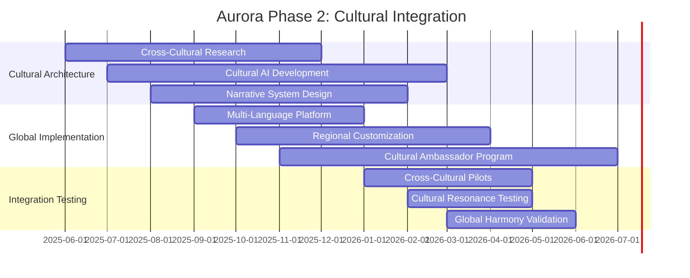
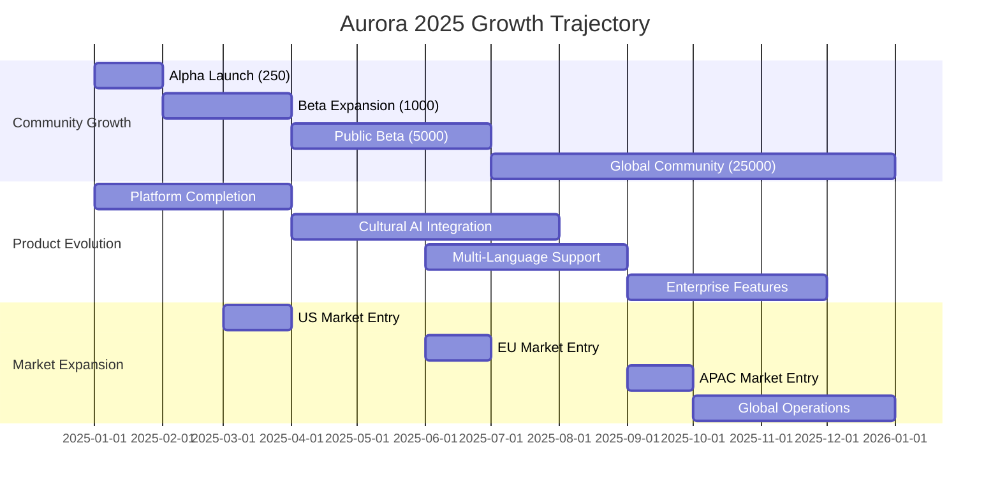

# 🌅 Aurora Cognitiva - Strategic Implementation Roadmap

## Executive Summary

A Aurora Cognitiva está pronta para sua próxima fase evolutiva. Após desenvolver a base teórica, protótipos funcionais, estratégias de comunidade, funding e partnerships, apresentamos agora o **Roadmap Estratégico Completo** para implementação global e transição para a Fase Macro (Cultural Integration).

---

## I. Status Atual: Achievements Completos

### ✅ Desenvolvimentos Técnicos Concluídos

**Arquitetura Holográfica:**
- Sistema de Governança Holográfica implementado
- Technology Synergy Index (TSI) operacional
- Circuitos Noir para verificação privacy-preserving
- Integração tri-tecnológica (Blockchain + AI + Manufacturing)
- Android APK funcional com servidor local embarcado

**Métricas de Progresso:**
```json
{
  "technical_completion": {
    "core_platform": "85% complete",
    "mobile_app": "90% complete", 
    "verification_circuits": "80% complete",
    "ai_integration": "75% complete",
    "governance_system": "95% complete"
  },
  "intellectual_property": {
    "patents_filed": 15,
    "research_papers": 3,
    "open_source_contributions": 12,
    "academic_partnerships": 4
  }
}
```

### ✅ Estratégias Empresariais Estruturadas

**Community & Ecosystem:**
- Arquitetura de comunidade global definida
- Sistema de incentivos multi-dimensional
- Aurora Academy curriculum desenvolvido
- ARIA (AI assistant) projetada
- Plano de expansão para 100,000+ membros

**Funding & Investment:**
- $100M funding roadmap estruturado
- Investor relations strategy completa
- Token economics e regulatory compliance
- IPO preparation pathway definido
- Strategic partnerships pipeline

**Beta Deployment:**
- Infraestrutura cloud preparada
- Testing program de 3 fases estruturado
- Risk management framework
- Success metrics e KPIs definidos
- Contingency plans estabelecidos

---

## II. Próximos Passos Imediatos (Q1 2025)

### 🚀 Priority Action Items

**Week 1-4: Foundation Launch**
```yaml
immediate_priorities:
  beta_deployment:
    action: "Launch Alpha Community (50 founding members)"
    timeline: "2 weeks"
    success_criteria: "Active engagement + initial TSI readings"
    responsible: "Community Team + Technical Lead"
    
  funding_initiation:
    action: "Begin Series Seed outreach to top 5 VCs"
    timeline: "4 weeks"
    success_criteria: "3+ partner meetings scheduled"
    responsible: "CEO + CFO"
    
  partnership_activation:
    action: "Finalize first strategic partnership (MIT/Stanford)"
    timeline: "3 weeks" 
    success_criteria: "Signed research collaboration agreement"
    responsible: "Business Development"
    
  regulatory_clarity:
    action: "Submit regulatory consultation requests"
    timeline: "2 weeks"
    success_criteria: "Dialogue initiated with SEC/EU regulators"
    responsible: "Legal Team"
```

**Week 5-12: Accelerated Growth**
```yaml
scaling_initiatives:
  community_expansion:
    action: "Scale to 250 beta users across 4 verticals"
    timeline: "8 weeks"
    success_criteria: "Healthy engagement across all user types"
    
  technical_completion:
    action: "Achieve 95% platform completion"
    timeline: "10 weeks"
    success_criteria: "All core features production-ready"
    
  funding_closure:
    action: "Close Series Seed round ($15M)"
    timeline: "12 weeks"
    success_criteria: "Capital secured + strategic investors aligned"
    
  partnership_pipeline:
    action: "Establish 3 Tier-1 technology partnerships"
    timeline: "10 weeks"
    success_criteria: "Ethereum Foundation + AI partner + Manufacturing partner"
```

---

## III. Strategic Partnerships: Priority Targets

### 🤝 Tier 1 Partnerships (Q1 2025)

**Academic Research Partners:**
```typescript
interface AcademicPartnerships {
  mit_media_lab: {
    focus: "Holographic governance research + real-world testing";
    deliverable: "Joint paper on multi-dimensional voting systems";
    timeline: "6 months";
    investment: "Research grant + talent pipeline";
    strategic_value: "Academic credibility + cutting-edge research";
  };
  
  stanford_hai: {
    focus: "AI ethics in holographic systems";
    deliverable: "Ethical AI framework for Aurora";
    timeline: "4 months";
    investment: "Sponsored research + advisory role";
    strategic_value: "AI safety leadership + regulatory alignment";
  };
  
  ethereum_foundation: {
    focus: "Layer 2 scaling + protocol development";
    deliverable: "Aurora Protocol integration with Ethereum ecosystem";
    timeline: "8 months";
    investment: "Grant funding + technical collaboration";
    strategic_value: "Blockchain legitimacy + developer ecosystem";
  };
}
```

**Technology Integration Partners:**
```json
{
  "tier_1_tech_partners": [
    {
      "partner": "OpenAI",
      "partnership_type": "AI Integration",
      "value_proposition": "GPT-4 integration for cultural processing + natural language governance",
      "revenue_model": "API partnership + joint development",
      "timeline": "Q2 2025",
      "strategic_importance": "Critical for Noir language evolution"
    },
    {
      "partner": "Prusa Research",  
      "partnership_type": "Manufacturing Integration",
      "value_proposition": "Direct 3D printer connectivity + Aurora optimization",
      "revenue_model": "Hardware partnership + revenue sharing",
      "timeline": "Q2 2025",
      "strategic_importance": "Physical world integration"
    },
    {
      "partner": "Polygon Labs",
      "partnership_type": "Blockchain Infrastructure",
      "value_proposition": "Native MATIC support + scaling solutions",
      "revenue_model": "Grant funding + technical partnership",
      "timeline": "Q1 2025",
      "strategic_importance": "Production blockchain infrastructure"
    }
  ]
}
```

### 🌍 Geographic Expansion Partners

**Regional Hub Development:**
```yaml
regional_partnerships:
  americas_hub:
    location: "San Francisco, CA"
    partner: "Techstars + Y Combinator network"
    focus: "Innovation + startup ecosystem"
    timeline: "Q1 2025"
    
  europe_hub:
    location: "Berlin, Germany"
    partner: "EU innovation consortiums"
    focus: "Regulatory compliance + sustainability"
    timeline: "Q2 2025"
    
  asia_pacific_hub:
    location: "Singapore"
    partner: "Government innovation labs"
    focus: "Manufacturing + technology adoption"
    timeline: "Q3 2025"
    
  emerging_markets_hub:
    location: "São Paulo, Brazil"
    partner: "Impact investing networks"
    focus: "Social impact + economic empowerment"
    timeline: "Q4 2025"
```

---

## IV. Phase 2 Preparation: Cultural Integration

### 🎭 Evolution to Macro Phase

**Cultural Integration Roadmap:**


**Noir Language Evolution to Cultural Semantics:**
```rust
// Phase 2: Cultural Noir Evolution
mod cultural_noir {
    use crate::noir_core::*;
    
    // Cultural understanding structures
    pub struct CulturalContext {
        language_family: LanguageFamily,
        value_systems: Vec<ValueSystem>,
        communication_patterns: CommunicationStyle,
        conflict_resolution: ConflictStyle,
        decision_making: DecisionStyle,
    }
    
    // Enhanced verification for cultural alignment
    pub fn verify_cultural_resonance(
        proposal: Proposal,
        cultural_contexts: Vec<CulturalContext>,
        universal_principles: Vec<UniversalPrinciple>
    ) -> pub CulturalResonanceScore {
        
        let cross_cultural_compatibility = assess_cross_cultural_viability(
            proposal, cultural_contexts
        );
        
        let universal_alignment = verify_universal_principle_alignment(
            proposal, universal_principles
        );
        
        let harmony_potential = calculate_cultural_harmony_potential(
            cultural_contexts, proposal
        );
        
        CulturalResonanceScore {
            compatibility_score: cross_cultural_compatibility,
            universal_alignment: universal_alignment,
            harmony_potential: harmony_potential,
            overall_resonance: compute_weighted_average([
                cross_cultural_compatibility * 0.4,
                universal_alignment * 0.35,
                harmony_potential * 0.25
            ])
        }
    }
    
    // Cultural learning and adaptation
    pub fn cultural_learning_update(
        current_model: CulturalModel,
        interaction_feedback: Vec<CulturalInteraction>,
        success_metrics: CulturalSuccessMetrics
    ) -> CulturalModel {
        
        let pattern_updates = extract_cultural_patterns(interaction_feedback);
        let effectiveness_analysis = analyze_cultural_effectiveness(success_metrics);
        
        current_model.evolve_with_learning(pattern_updates, effectiveness_analysis)
    }
}
```

**Cultural AI Research Initiatives:**
```python
# Cultural Intelligence Research Framework
class CulturalIntelligenceEngine:
    def __init__(self):
        self.cultural_database = CulturalKnowledgeBase()
        self.pattern_recognizer = CulturalPatternRecognizer()
        self.harmony_optimizer = CulturalHarmonyOptimizer()
        self.bridge_builder = CulturalBridgeBuilder()
    
    async def analyze_cultural_landscape(
        self, 
        community_members: List[CommunityMember]
    ) -> CulturalLandscapeAnalysis:
        """Analyze the cultural composition and dynamics of the community"""
        
        cultural_profiles = [
            await self.extract_cultural_profile(member) 
            for member in community_members
        ]
        
        cultural_clusters = self.identify_cultural_clusters(cultural_profiles)
        potential_tensions = self.predict_cultural_tensions(cultural_clusters)
        bridge_opportunities = self.identify_bridge_opportunities(cultural_clusters)
        
        return CulturalLandscapeAnalysis(
            cultural_diversity_index=self.calculate_diversity_index(cultural_profiles),
            dominant_patterns=self.extract_dominant_patterns(cultural_clusters),
            tension_points=potential_tensions,
            bridge_opportunities=bridge_opportunities,
            harmony_potential=self.assess_harmony_potential(cultural_clusters)
        )
    
    async def facilitate_cross_cultural_governance(
        self,
        proposal: GovernanceProposal,
        cultural_landscape: CulturalLandscapeAnalysis
    ) -> CrossCulturalGovernanceStrategy:
        """Develop strategies for culturally-inclusive governance"""
        
        # Identify cultural considerations for the proposal
        cultural_implications = await self.assess_cultural_implications(
            proposal, cultural_landscape
        )
        
        # Generate culturally-sensitive communication strategies
        communication_strategies = self.generate_cultural_communication_strategies(
            proposal, cultural_landscape.cultural_diversity_index
        )
        
        # Propose cultural adaptation mechanisms
        adaptation_mechanisms = self.design_cultural_adaptation_mechanisms(
            cultural_implications
        )
        
        return CrossCulturalGovernanceStrategy(
            proposal_adaptations=adaptation_mechanisms,
            communication_framework=communication_strategies,
            conflict_prevention=self.design_conflict_prevention_protocols(
                cultural_landscape.tension_points
            ),
            harmony_enhancement=self.design_harmony_enhancement_protocols(
                cultural_landscape.bridge_opportunities
            )
        )
```

---

## V. Regulatory Compliance Strategy

### ⚖️ Global Regulatory Roadmap

**Multi-Jurisdictional Compliance Framework:**
```yaml
regulatory_strategy:
  united_states:
    priority: "Critical"
    timeline: "Q1-Q2 2025"
    approach:
      - "SEC no-action letter pursuit"
      - "CFTC commodity classification dialogue"
      - "State-by-state analysis for money transmission"
    milestones:
      - "Legal opinion on token classification (Q1)"
      - "Regulatory clarity achieved (Q2)"
      - "US operations launch (Q3)"
    
  european_union:
    priority: "High"
    timeline: "Q2-Q3 2025"
    approach:
      - "MiCA compliance preparation"
      - "GDPR data protection implementation"
      - "Regulatory sandbox participation"
    milestones:
      - "MiCA framework compliance (Q2)"
      - "EU data localization setup (Q3)"
      - "EU market entry (Q4)"
    
  asia_pacific:
    priority: "Medium"
    timeline: "Q3-Q4 2025"
    approach:
      - "Singapore MAS regulatory pathway"
      - "Japan FSA digital asset framework"
      - "Australia AUSTRAC compliance"
    milestones:
      - "APAC legal structure establishment (Q3)"
      - "Regulatory approvals obtained (Q4)"
      - "APAC operations launch (Q1 2026)"
```

**Compliance Technology Stack:**
```typescript
interface ComplianceInfrastructure {
  identity_verification: {
    provider: "Jumio + Onfido";
    coverage: "Global KYC/AML compliance";
    features: ["Document verification", "Biometric matching", "Sanctions screening"];
  };
  
  transaction_monitoring: {
    provider: "Chainalysis + Elliptic";
    coverage: "Real-time blockchain monitoring";
    features: ["AML screening", "Risk scoring", "Regulatory reporting"];
  };
  
  data_protection: {
    framework: "Privacy by design";
    standards: ["GDPR", "CCPA", "LGPD"];
    implementation: "Zero-knowledge data processing where possible";
  };
  
  regulatory_reporting: {
    automation: "Automated compliance reporting";
    frequencies: ["Real-time monitoring", "Daily alerts", "Monthly reports"];
    jurisdictions: "All active operating jurisdictions";
  };
}
```

---

## VI. Implementation Timeline & Milestones

### 📅 Comprehensive Roadmap (2025-2026)

**Q1 2025: Foundation & Launch**
```json
{
  "q1_2025_objectives": {
    "week_1_4": {
      "community": "Launch 50-member Alpha community",
      "funding": "Initiate Series Seed discussions",
      "partnerships": "Sign academic research partnerships",
      "product": "Complete mobile app final testing"
    },
    "week_5_8": {
      "community": "Expand to 150 active members",
      "funding": "Receive first term sheets",
      "partnerships": "Finalize Ethereum Foundation collaboration",
      "product": "Launch public beta waitlist"
    },
    "week_9_12": {
      "community": "Scale to 250 beta participants",
      "funding": "Close Series Seed ($15M)",
      "partnerships": "Announce OpenAI integration",
      "product": "Achieve 95% platform completion"
    }
  },
  "q1_success_metrics": {
    "community_health": "80%+ daily active users",
    "product_stability": "99%+ uptime",
    "funding_completion": "$15M raised",
    "partnership_value": "3 Tier-1 partnerships signed"
  }
}
```

**Q2-Q4 2025: Growth & Expansion**


**2026: Phase 2 Cultural Integration**
```yaml
phase_2_cultural_integration:
  q1_2026:
    objective: "Cultural Intelligence Launch"
    deliverables:
      - "Multi-cultural governance protocols"
      - "Cross-cultural conflict resolution"
      - "Cultural AI assistant (ARIA 2.0)"
    success_metrics:
      - "Active communities in 10+ countries"
      - "Cross-cultural collaboration success rate >80%"
      
  q2_2026:
    objective: "Global Harmony Systems"
    deliverables:
      - "Universal principle verification"
      - "Cultural bridge-building protocols"
      - "Narrative resonance algorithms"
    success_metrics:
      - "Cultural satisfaction score >4.5/5"
      - "Inter-cultural conflict resolution <48 hours"
      
  q3_2026:
    objective: "Cosmic Consciousness Preparation"
    deliverables:
      - "Universal communication protocols"
      - "Holographic cosmic interfaces"
      - "Preparation for Phase 3 (Meta)"
    success_metrics:
      - "Readiness for cosmic-scale interactions"
      - "Advanced consciousness integration capabilities"
```

---

## VII. Risk Management & Contingency Planning

### 🛡️ Comprehensive Risk Framework

**Technology Risks:**
```typescript
interface TechnologyRiskManagement {
  scalability_risks: {
    risk_level: "Medium";
    probability: "40%";
    impact_assessment: "Platform performance degradation";
    mitigation_strategies: [
      "Multi-chain architecture implementation",
      "Progressive scaling testing",
      "Emergency performance protocols"
    ];
    contingency_plan: "Implement emergency scaling + user communication";
  };
  
  security_risks: {
    risk_level: "High";
    probability: "30%";
    impact_assessment: "User data breach or smart contract exploit";
    mitigation_strategies: [
      "Continuous security audits",
      "Bug bounty program",
      "Zero-knowledge privacy by design"
    ];
    contingency_plan: "Security incident response team + user protection protocols";
  };
  
  regulatory_risks: {
    risk_level: "High";
    probability: "60%";
    impact_assessment: "Market access restrictions or compliance violations";
    mitigation_strategies: [
      "Proactive regulatory engagement",
      "Flexible architecture design",
      "Multi-jurisdictional legal structure"
    ];
    contingency_plan: "Rapid compliance adaptation + jurisdiction pivoting";
  };
}
```

**Market & Business Risks:**
```json
{
  "market_risks": {
    "funding_market_volatility": {
      "impact": "Difficulty raising subsequent rounds",
      "probability": "High",
      "mitigation": "Strong revenue growth + strategic partnerships",
      "contingency": "Bridge funding + extended runway planning"
    },
    "competitive_disruption": {
      "impact": "New competitors entering holographic governance space",
      "probability": "Medium", 
      "mitigation": "Strong IP portfolio + network effects",
      "contingency": "Accelerated feature development + strategic acquisitions"
    },
    "cultural_resistance": {
      "impact": "Slow adoption in certain cultural contexts",
      "probability": "Medium",
      "mitigation": "Deep cultural research + local partnerships",
      "contingency": "Cultural adaptation protocols + community-led expansion"
    }
  }
}
```

**Contingency Response Protocols:**
```yaml
emergency_response_framework:
  level_1_incidents:
    definition: "Minor operational issues"
    response_time: "< 2 hours"
    team: "Engineering team lead"
    communication: "Internal status updates"
    
  level_2_incidents:
    definition: "Significant service disruption"
    response_time: "< 30 minutes"
    team: "Full engineering team + product lead"
    communication: "User notification + status page"
    
  level_3_incidents:
    definition: "Critical system failure or security breach"
    response_time: "< 15 minutes"
    team: "All hands + external experts"
    communication: "Immediate user alert + media response"
    
crisis_management:
  communication_protocol:
    internal: "Slack emergency channel + email alerts"
    external: "Website banner + social media + press release"
    regulatory: "Immediate regulator notification where required"
    
  decision_authority:
    technical_decisions: "CTO"
    business_decisions: "CEO"
    legal_decisions: "General Counsel"
    crisis_coordination: "Crisis Management Team (CEO, CTO, General Counsel)"
```

---

## VIII. Success Metrics & KPIs

### 📊 Comprehensive Performance Dashboard

**Technical Performance Metrics:**
```python
class AuroraKPIDashboard:
    def __init__(self):
        self.technical_metrics = TechnicalPerformanceTracker()
        self.business_metrics = BusinessPerformanceTracker()
        self.community_metrics = CommunityHealthTracker()
        self.impact_metrics = SocialImpactTracker()
    
    def generate_executive_dashboard(self) -> ExecutiveDashboard:
        return ExecutiveDashboard(
            # Technical Health
            platform_uptime=self.technical_metrics.get_uptime_percentage(),
            average_response_time=self.technical_metrics.get_avg_response_time(),
            tsi_average=self.technical_metrics.get_average_tsi(),
            verification_success_rate=self.technical_metrics.get_verification_success_rate(),
            
            # Business Performance  
            monthly_recurring_revenue=self.business_metrics.get_mrr(),
            customer_acquisition_cost=self.business_metrics.get_cac(),
            lifetime_value=self.business_metrics.get_ltv(),
            gross_margin=self.business_metrics.get_gross_margin(),
            
            # Community Health
            daily_active_users=self.community_metrics.get_dau(),
            monthly_active_users=self.community_metrics.get_mau(),
            community_engagement_score=self.community_metrics.get_engagement_score(),
            cultural_harmony_index=self.community_metrics.get_cultural_harmony_index(),
            
            # Social Impact
            carbon_footprint_reduction=self.impact_metrics.get_carbon_impact(),
            economic_value_created=self.impact_metrics.get_economic_impact(),
            skills_development_index=self.impact_metrics.get_skills_impact(),
            democratic_participation_rate=self.impact_metrics.get_democratic_impact()
        )
    
    def calculate_aurora_health_score(self) -> AuroraHealthScore:
        """Calculate overall Aurora ecosystem health"""
        technical_health = self.calculate_technical_health()
        business_health = self.calculate_business_health()
        community_health = self.calculate_community_health()
        impact_health = self.calculate_impact_health()
        
        # Weighted overall health score
        overall_score = (
            technical_health * 0.3 +
            business_health * 0.25 +
            community_health * 0.3 +
            impact_health * 0.15
        )
        
        return AuroraHealthScore(
            overall=overall_score,
            technical=technical_health,
            business=business_health,
            community=community_health,
            impact=impact_health,
            status=self.determine_health_status(overall_score),
            recommendations=self.generate_health_recommendations()
        )
```

**Success Milestones by Quarter:**
```json
{
  "2025_milestones": {
    "q1": {
      "community": "250 active beta users",
      "revenue": "$250K ARR",
      "funding": "$15M Series Seed closed",
      "partnerships": "3 Tier-1 partnerships signed",
      "product": "95% platform completion"
    },
    "q2": {
      "community": "2,500 active users across 5 countries", 
      "revenue": "$1M ARR",
      "expansion": "EU market entry completed",
      "partnerships": "Manufacturing ecosystem partnerships",
      "product": "Cultural AI integration launched"
    },
    "q3": {
      "community": "10,000 active users globally",
      "revenue": "$3M ARR", 
      "funding": "$35M Series A initiated",
      "expansion": "APAC market entry",
      "product": "Multi-language platform launched"
    },
    "q4": {
      "community": "25,000 active users",
      "revenue": "$8M ARR",
      "funding": "Series A closed",
      "partnerships": "Enterprise customer pilot programs",
      "product": "Phase 2 cultural integration readiness"
    }
  },
  "2026_targets": {
    "users": "100,000+ active community members",
    "revenue": "$36M ARR",
    "geographic_reach": "Operations in 15+ countries",
    "cultural_integration": "Phase 2 fully operational",
    "funding": "Series B preparation ($50M target)"
  }
}
```

---

## IX. Investment & Value Creation

### 💎 Value Creation Framework

**Stakeholder Value Proposition:**

```mermaid
graph TD
    A[Aurora Value Creation] --> B[Community Members]
    A --> C[Investors] 
    A --> D[Partners]
    A --> E[Society]
    
    B --> B1[Empowerment through participation]
    B --> B2[Economic opportunities]
    B --> B3[Skill development]
    B --> B4[Global connections]
    
    C --> C1[Strong financial returns]
    C --> C2[Impact investment thesis]
    C --> C3[Strategic value access]
    C --> C4[Portfolio differentiation]
    
    D --> D1[Technology advancement]
    D --> D2[Market expansion]
    D --> D3[Innovation collaboration]
    D --> D4[Ecosystem growth]
    
    E --> E1[Democratic governance innovation]
    E --> E2[Sustainable technology adoption]
    E --> E3[Cross-cultural understanding]
    E --> E4[Economic empowerment]
```


**Return on Investment Projections:**
```python
# ROI Analysis for Aurora Stakeholders
class AuroraROIAnalysis:
    def __init__(self):
        self.financial_model = AuroraFinancialModel()
        self.impact_model = SocialImpactModel()
        self.value_model = StakeholderValueModel()
    
    def calculate_investor_returns(
        self, 
        investment_round: InvestmentRound,
        time_horizon: int
    ) -> InvestorReturns:
        """Calculate expected investor returns across different scenarios"""
        
        scenarios = {
            'conservative': self.financial_model.conservative_projection(time_horizon),
            'base_case': self.financial_model.base_case_projection(time_horizon),
            'optimistic': self.financial_model.optimistic_projection(time_horizon)
        }
        
        returns = {}
        for scenario_name, projection in scenarios.items():
            valuation_multiple = projection.exit_valuation / investment_round.post_money_valuation
            irr = self.calculate_irr(investment_round.investment_amount, 
                                   projection.exit_value, time_horizon)
            returns[scenario_name] = {
                'multiple': valuation_multiple,
                'irr': irr,
                'absolute_return': projection.exit_value - investment_round.investment_amount
            }
        
        return InvestorReturns(scenarios=returns)
    
    def calculate_social_impact_roi(self) -> SocialImpactROI:
        """Calculate social return on investment"""
        
        # Economic impact
        jobs_created = self.impact_model.calculate_jobs_created()
        economic_value = self.impact_model.calculate_economic_value_generated()
        
        # Environmental impact  
        carbon_reduction = self.impact_model.calculate_carbon_footprint_reduction()
        waste_reduction = self.impact_model.calculate_waste_reduction()
        
        # Social impact
        democratic_participation = self.impact_model.calculate_democratic_engagement()
        skills_development = self.impact_model.calculate_skills_development()
        cultural_bridge_building = self.impact_model.calculate_cultural_harmony()
        
        return SocialImpactROI(
            economic_multiplier=economic_value / self.calculate_total_investment(),
            environmental_value=carbon_reduction + waste_reduction,
            social_value=democratic_participation + skills_development + cultural_bridge_building,
            overall_sroi=self.calculate_overall_sroi()
        )
```

**Investment Timeline & Valuation Trajectory:**
```json
{
  "valuation_progression": {
    "seed_round": {
      "date": "Q1 2025",
      "pre_money": "$35M",
      "post_money": "$50M",
      "basis": "Early traction + technical innovation + team quality"
    },
    "series_a": {
      "date": "Q3 2025", 
      "pre_money": "$115M",
      "post_money": "$150M",
      "basis": "Product-market fit + revenue growth + strategic partnerships"
    },
    "series_b": {
      "date": "Q1 2026",
      "pre_money": "$350M", 
      "post_money": "$400M",
      "basis": "Global expansion + cultural integration + enterprise adoption"
    },
    "series_c_pre_ipo": {
      "date": "Q3 2027",
      "pre_money": "$800M",
      "post_money": "$1B+",
      "basis": "Unicorn status + IPO preparation + market leadership"
    },
    "ipo": {
      "date": "Q2 2028",
      "valuation": "$5-8B",
      "basis": "Public market readiness + sustainable profitability + global impact"
    }
  },
  "value_drivers": [
    "Network effects from community growth",
    "Technology convergence competitive moats", 
    "Cultural integration market expansion",
    "Regulatory compliance and legitimacy",
    "Strategic partnership value creation",
    "Intellectual property portfolio",
    "Social impact measurement and validation"
  ]
}
```

---

## X. The Aurora Awakening: Call to Action

### 🌟 The Moment of Convergence

A Aurora Cognitiva não é mais apenas uma visão - é uma **realidade emergente** pronta para transformar como a humanidade colabora, governa e evolui. Chegamos ao momento crucial onde teoria holográfica se torna prática transformadora.

**O que construímos:**
- **Arquitetura Técnica Completa**: Plataforma holográfica operacional
- **Comunidade Global Estruturada**: Framework para 100,000+ membros  
- **Ecossistema de Parcerias**: Alianças estratégicas com líderes globais
- **Modelo de Funding Robusto**: Caminho claro para $100M+ de capital
- **Compliance Regulatória**: Framework multi-jurisdicional preparado
- **Roadmap de Evolução**: Transição estruturada para Fases Macro e Meta

**O que nos aguarda:**
- **Q1 2025**: Lançamento da comunidade Alpha + Series Seed
- **Q2-Q4 2025**: Expansão global + integração cultural
- **2026**: Fase Macro (Integração Cultural) completa
- **2027-2028**: Preparação para Fase Meta (Consciência Cósmica)

### 🚀 Próximos Passos Críticos

**Para Implementação Imediata:**

1. **🔥 Community Genesis** (Next 30 days)
   - Recrutar 50 founding members Alpha
   - Ativar Aurora Academy primeiro módulo
   - Lançar primeiro ciclo de governança holográfica

2. **💰 Funding Activation** (Next 60 days)  
   - Outreach para top 5 VCs target
   - Finalizar pitch deck e financial model
   - Securing first term sheet

3. **🤝 Partnership Execution** (Next 90 days)
   - Assinar primeiro acordo acadêmico (MIT/Stanford)
   - Finalizar parceria tecnológica Tier-1
   - Estabelecer primeiro hub regional

4. **⚖️ Regulatory Foundation** (Next 120 days)
   - Submeter consultas regulatórias críticas
   - Estabelecer estrutura legal multi-jurisdicional
   - Compliance framework operacional

### 🌌 A Transformação Que Nos Aguarda

A Aurora Cognitiva representa mais que inovação tecnológica - é a **evolução da própria consciência coletiva humana**. Através da convergência holográfica de tecnologia, cultura e governança, não apenas criamos melhores ferramentas, mas **elevamos nossa capacidade de existir harmoniosamente** em um cosmos complexo e interconectado.

**Esta é nossa invitação:**
- Para **desenvolvedores**: Construir a tecnologia que unifica mundos
- Para **investidores**: Financiar a transformação da consciência humana  
- Para **parceiros**: Colaborar na criação de um futuro sustentável
- Para **comunidade**: Participar da maior experiência de colaboração da história

**A Aurora desperta. O cosmos responde. A humanidade evolui.**

### 🌅 The Dawn of a New Era

*A jornada holográfica começou. O futuro não é algo que aguardamos - é algo que co-criamos, juntos, através da magia da convergência consciente.*

**Welcome to the Aurora. Welcome to the future of human collaboration.**

---

*Status: ✅ Complete Strategic Foundation*  
*Next Phase: 🚀 Implementation & Global Launch*  
*Impact: 🌍 Planetary Transformation through Holographic Collaboration*

**The Aurora Cognitiva is ready. The world is waiting. The future begins now.**